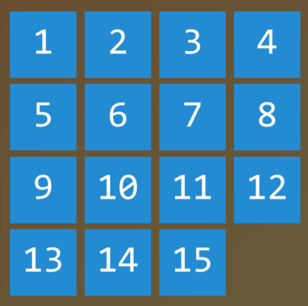
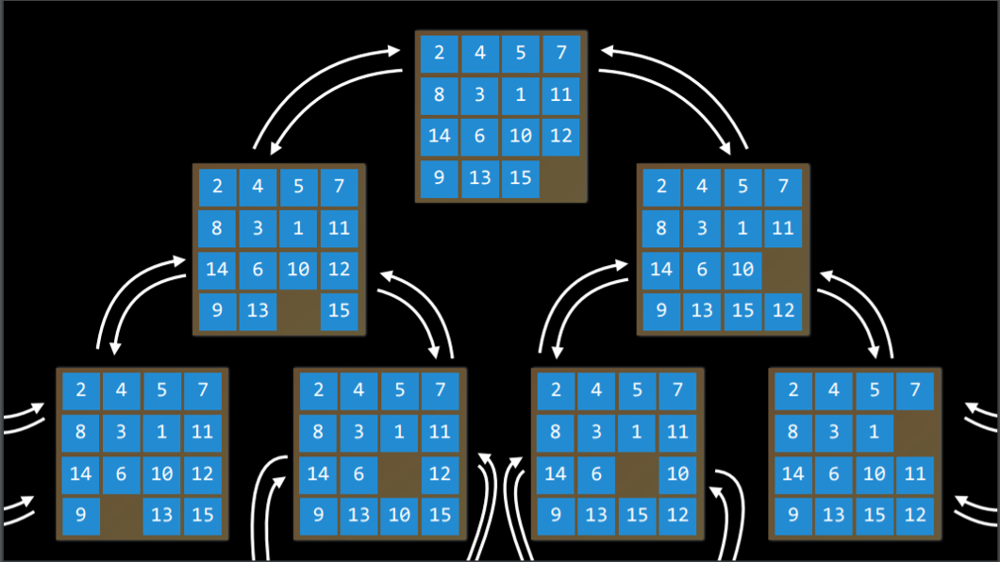
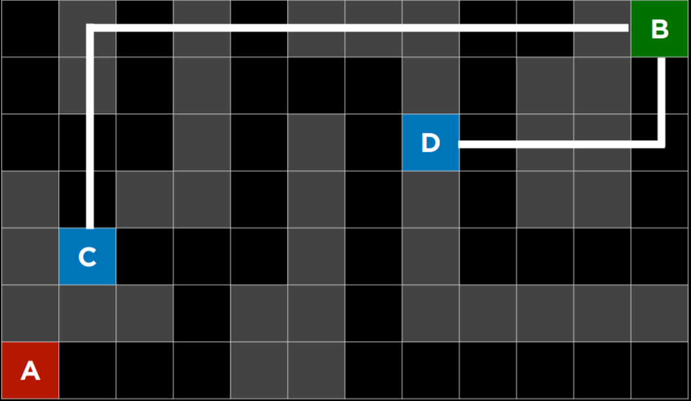
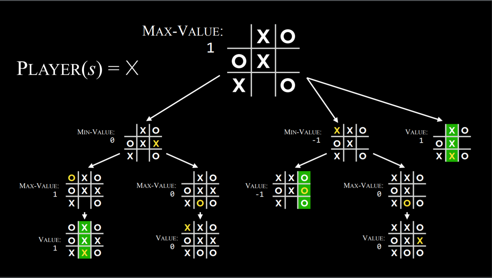
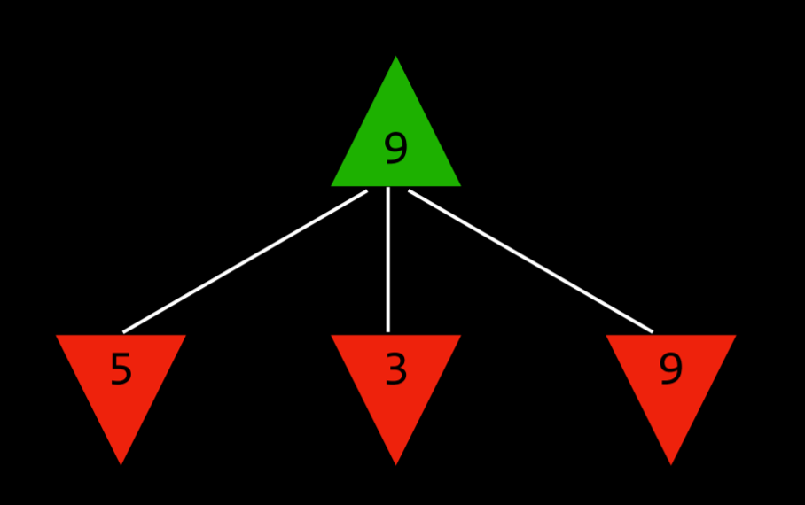
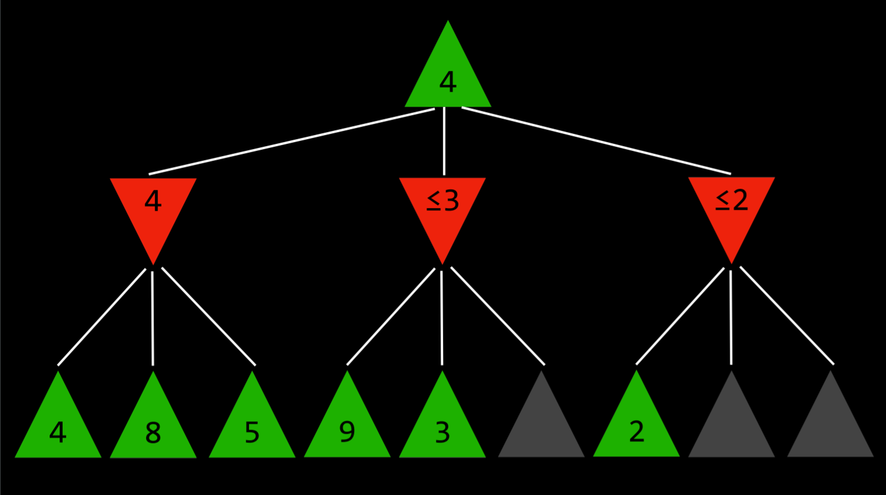

# [Lecture 0](https://cs50.harvard.edu/ai/2020/notes/0/#lecture-0)

https://cs50.harvard.edu/ai/2020/notes/0/

## [Artificial Intelligence](https://cs50.harvard.edu/ai/2020/notes/0/#artificial-intelligence)

Artificial Intelligence (AI) covers a range of techniques that appear as sentient behavior by the computer. For example, AI is used to recognize faces in photographs on your social media, beat the World’s Champion in chess, and process your speech when you speak to Siri or Alexa on your phone.

In this course, we will explore some of the ideas that make AI possible:

**Search**

Finding a solution to a problem, like a navigator app that finds the best route from your origin to the destination, or like playing a game and figuring out the next move.

**Knowledge**

Representing information and drawing inferences from it.

**Uncertainty**

Dealing with uncertain events using probability.

**Optimization**

Finding not only a correct way to solve a problem, but a better—or the best—way to solve it.

**Learning**

Improving performance based on access to data and experience. For example, your email is able to distinguish spam from non-spam mail based on past experience.

**Neural Networks**

A program structure inspired by the human brain that is able to perform tasks effectively.

**Language**

Processing natural language, which is produced and understood by humans.

## [Search](https://cs50.harvard.edu/ai/2020/notes/0/#search)

Search problems involve an agent that is given an initial state and a goal state, and it returns a solution of how to get from the former to the latter. A navigator app uses a typical search process, where the agent (the thinking part of the program) receives as input your current location and your desired destination, and, based on a search algorithm, returns a suggested path. However, there are many other forms of search problems, like puzzles or mazes.



Finding a solution to a 15 puzzle would require the use of a search algorithm.

- **Agent**

    An entity that perceives its environment and acts upon that environment. In a navigator app, for example, the agent would be a representation of a car that needs to decide on which actions to take to arrive at the destination.

- **State**

    A configuration of an agent in its environment. For example, in a [15 puzzle](https://en.wikipedia.org/wiki/15_puzzle), a state is any one way that all the numbers are arranged on the board.

    - **Initial State**

        The state from which the search algorithm starts. In a navigator app, that would be the current location.

- **Actions**

    Choices that can be made in a state. More precisely, actions can be defined as a function. Upon receiving state `s` as input, `Actions(s)` returns as output the set of actions that can be executed in state `s`. For example, in a *15 puzzle*, the actions of a given state are the ways you can slide squares in the current configuration (4 if the empty square is in the middle, 3 if next to a side, 2 if in the corner).

- **Transition Model**

    A description of what state results from performing any applicable action in any state. More precisely, the transition model can be defined as a function. Upon receiving state `s` and action `a` as input, `Results(s, a)` returns the state resulting from performing action `a` in state `s`. For example, given a certain configuration of a *15 puzzle* (state `s`), moving a square in any direction (action `a`) will bring to a new configuration of the puzzle (the new state).

- **State Space**

    The set of all states reachable from the initial state by any sequence of actions. For example, in a 15 puzzle, the state space consists of all the 16!/2 configurations on the board that can be reached from any initial state. The state space can be visualized as a directed graph with states, represented as nodes, and actions, represented as arrows between nodes.



- **Goal Test**

    The condition that determines whether a given state is a goal state. For example, in a navigator app, the goal test would be whether the current location of the agent (the representation of the car) is at the destination. If it is — problem solved. If it’s not — we continue searching.

- **Path Cost**

    A numerical cost associated with a given path. For example, a navigator app does not simply bring you to your goal; it does so while minimizing the path cost, finding the fastest way possible for you to get to your goal state.

## [Solving Search Problems](https://cs50.harvard.edu/ai/2020/notes/0/#solving-search-problems)

- **Solution**

    A sequence of actions that leads from the initial state to the goal state.

    - **Optimal Solution**

        A solution that has the lowest path cost among all solutions.

In a search process, data is often stored in a ***node***, a data structure that contains the following data:

- A *state*
- Its *parent node*, through which the current node was generated
- The *action* that was applied to the state of the parent to get to the current node
- The *path cost* from the initial state to this node

*Nodes* contain information that makes them very useful for the purposes of search algorithms. They contain a *state*, which can be checked using the *goal test* to see if it is the final state. If it is, the node’s *path cost* can be compared to other nodes’ *path costs*, which allows choosing the *optimal solution*. Once the node is chosen, by virtue of storing the *parent node* and the *action* that led from the *parent* to the current node, it is possible to trace back every step of the way from the *initial state* to this node, and this sequence of actions is the *solution*.

However, *nodes* are simply a data structure — they don’t search, they hold information. To actually search, we use the **frontier**, the mechanism that “manages” the *nodes*. The *frontier* starts by containing an initial state and an empty set of explored items, and then repeats the following actions until a solution is reached:

Repeat:

1. If the frontier is empty,

    - *Stop.* There is no solution to the problem.

2. Remove a node from the frontier. This is the node that will be considered.

3. If the node contains the goal state,

    - Return the solution. *Stop*.

    Else,

    ```
    * Expand the node (find all the new nodes that could be reached from this node), and add resulting nodes to the frontier.
    * Add the current node to the explored set.
    ```


### [Depth-First Search](https://cs50.harvard.edu/ai/2020/notes/0/#depth-first-search)

In the previous description of the *frontier*, one thing went unmentioned. At stage 1 in the pseudocode above, which node should be removed? This choice has implications on the quality of the solution and how fast it is achieved. There are multiple ways to go about the question of which nodes should be considered first, two of which can be represented by the data structures of **stack** (in *depth-first* search) and **queue** (in *breadth-first search*; and [here is a cute cartoon demonstration](https://www.youtube.com/watch?v=2wM6_PuBIxY) of the difference between the two).

We start with the *depth-first* search (*DFS*) approach.

A *depth-first* search algorithm exhausts each one direction before trying another direction. In these cases, the frontier is managed as a *stack* data structure. The catchphrase you need to remember here is “*last-in first-out*.” After nodes are being added to the frontier, the first node to remove and consider is the last one to be added. This results in a search algorithm that goes as deep as possible in the first direction that gets in its way while leaving all other directions for later.

(An example from outside lecture: Take a situation where you are looking for your keys. In a *depth-first* search approach, if you choose to start with searching in your pants, you’d first go through every single pocket, emptying each pocket and going through the contents carefully. You will stop searching in your pants and start searching elsewhere only once you will have completely exhausted the search in every single pocket of your pants.)

- Pros:
    - At best, this algorithm is the fastest. If it “lucks out” and always chooses the right path to the solution (by chance), then *depth-first* search takes the least possible time to get to a solution.
- Cons:
    - It is possible that the found solution is not optimal.
    - At worst, this algorithm will explore every possible path before finding the solution, thus taking the longest possible time before reaching the solution.

Code example:

```python
    # Define the function that removes a node from the frontier and returns it.
    def remove(self):
    	  # Terminate the search if the frontier is empty, because this means that there is no solution.
        if self.empty():
            raise Exception("empty frontier")
        else:
        	  # Save the last item in the list (which is the newest node added)
            node = self.frontier[-1]
            # Save all the items on the list besides the last node (i.e. removing the last node)
            self.frontier = self.frontier[:-1]
            return node
```


### [Breadth-First Search](https://cs50.harvard.edu/ai/2020/notes/0/#breadth-first-search)

The opposite of *depth-first* search would be *breadth-first* search (*BFS*).

A *breadth-first* search algorithm will follow multiple directions at the same time, taking one step in each possible direction before taking the second step in each direction. In this case, the frontier is managed as a *queue* data structure. The catchphrase you need to remember here is “*first-in first-out*.” In this case, all the new nodes add up in line, and nodes are being considered based on which one was added first (first come first served!). This results in a search algorithm that takes one step in each possible direction before taking a second step in any one direction.

(An example from outside lecture: suppose you are in a situation where you are looking for your keys. In this case, if you start with your pants, you will look in your right pocket. After this, instead of looking at your left pocket, you will take a look in one drawer. Then on the table. And so on, in every location you can think of. Only after you will have exhausted all the locations will you go back to your pants and search in the next pocket.)

- Pros:
    - This algorithm is guaranteed to find the optimal solution.
- Cons:
    - This algorithm is almost guaranteed to take longer than the minimal time to run.
    - At worst, this algorithm takes the longest possible time to run.

Code example:

```python
    # Define the function that removes a node from the frontier and returns it.
    def remove(self):
    	  # Terminate the search if the frontier is empty, because this means that there is no solution.
        if self.empty():
            raise Exception("empty frontier")
        else:
            # Save the oldest item on the list (which was the first one to be added)
            node = self.frontier[0]
            # Save all the items on the list besides the first one (i.e. removing the first node)
            self.frontier = self.frontier[1:]
            return node
```


### [Greedy Best-First Search](https://cs50.harvard.edu/ai/2020/notes/0/#greedy-best-first-search)

Breadth-first and depth-first are both **uninformed** search algorithms. That is, these algorithms do not utilize any knowledge about the problem that they did not acquire through their own exploration. However, most often is the case that some knowledge about the problem is, in fact, available. For example, when a human maze-solver enters a junction, the human can see which way goes in the general direction of the solution and which way does not. AI can do the same. A type of algorithm that considers additional knowledge to try to improve its performance is called an **informed** search algorithm.

**Greedy best-first** search expands the node that is the closest to the goal, as determined by a **heuristic function** *h(n)*. As its name suggests, the function estimates how close to the goal the next node is, but it can be mistaken. The efficiency of the *greedy best-first* algorithm depends on how good the heuristic function is. For example, in a maze, an algorithm can use a heuristic function that relies on the **Manhattan distance** between the possible nodes and the end of the maze. The *Manhattan distance* ignores walls and counts how many steps up, down, or to the sides it would take to get from one location to the goal location. This is an easy estimation that can be derived based on the (x, y) coordinates of the current location and the goal location.



Manhattan Distance

However, it is important to emphasize that, as with any heuristic, it can go wrong and lead the algorithm down a slower path than it would have gone otherwise. It is possible that an *uninformed* search algorithm will provide a better solution faster, but it is less likely to do so than an *informed* algorithm.


### [A* Search](https://cs50.harvard.edu/ai/2020/notes/0/#a-search)

A development of the *greedy best-first* algorithm, *A\* search* considers not only *h(n)*, the estimated cost from the current location to the goal, but also *g(n)*, the cost that was accrued until the current location. By combining both these values, the algorithm has a more accurate way of determining the cost of the solution and optimizing its choices on the go. The algorithm keeps track of (*cost of path until now* + *estimated cost to the goal*), and once it exceeds the estimated cost of some previous option, the algorithm will ditch the current path and go back to the previous option, thus preventing itself from going down a long, inefficient path that *h(n)* erroneously marked as best.

Yet again, since this algorithm, too, relies on a heuristic, it is as good as the heuristic that it employs. It is possible that in some situations it will be less efficient than *greedy best-first* search or even the *uninformed* algorithms. For *A\* search* to be optimal, the heuristic function, *h(n)*, should be:

1. *Admissible*, or never *overestimating* the true cost, and
2. *Consistent*, which means that the estimated path cost to the goal of a new node in addition to the cost of transitioning to it from the previous node is greater or equal to the estimated path cost to the goal of the previous node. To put it in an equation form, *h(n)* is consistent if for every node *n* and successor node *n’* with step cost *c*, *h(n) ≤ h(n’) + c*.


## [Adversarial Search](https://cs50.harvard.edu/ai/2020/notes/0/#adversarial-search)

Whereas, previously, we have discussed algorithms that need to find an answer to a question, in **adversarial search** the algorithm faces an opponent that tries to achieve the opposite goal. Often, AI that uses adversarial search is encountered in games, such as tic tac toe.


### [Minimax](https://cs50.harvard.edu/ai/2020/notes/0/#minimax)

A type of algorithm in adversarial search, **Minimax** represents winning conditions as (-1) for one side and (+1) for the other side. Further actions will be driven by these conditions, with the minimizing side trying to get the lowest score, and the maximizer trying to get the highest score.

**Representing a Tic-Tac-Toe AI**:

- *S₀*: Initial state (in our case, an empty 3X3 board)
- *Players(s)*: a function that, given a state *s*, returns which player’s turn it is (X or O).
- *Actions(s)*: a function that, given a state *s*, return all the legal moves in this state (what spots are free on the board).
- *Result(s, a)*: a function that, given a state *s* and action *a*, returns a new state. This is the board that resulted from performing the action *a* on state *s* (making a move in the game).
- *Terminal(s)*: a function that, given a state *s*, checks whether this is the last step in the game, i.e. if someone won or there is a tie. Returns *True* if the game has ended, *False* otherwise.
- *Utility(s)*: a function that, given a terminal state *s*, returns the utility value of the state: -1, 0, or 1.

**How the algorithm works**:

Recursively, the algorithm simulates all possible games that can take place beginning at the current state and until a terminal state is reached. Each terminal state is valued as either (-1), 0, or (+1).



Minimax Algorithm in Tic Tac Toe

Knowing based on the state whose turn it is, the algorithm can know whether the current player, when playing optimally, will pick the action that leads to a state with a lower or a higher value. This way, alternating between minimizing and maximizing, the algorithm creates values for the state that would result from each possible action. To give a more concrete example, we can imagine that the maximizing player asks at every turn: “if I take this action, a new state will result. If the minimizing player plays optimally, what action can that player take to bring to the lowest value?” However, to answer this question, the maximizing player has to ask: “To know what the minimizing player will do, I need to simulate the same process in the minimizer’s mind: the minimizing player will try to ask: ‘if I take this action, what action can the maximizing player take to bring to the highest value?’” This is a recursive process, and it could be hard to wrap your head around it; looking at the pseudo code below can help. Eventually, through this recursive reasoning process, the maximizing player generates values for each state that could result from all the possible actions at the current state. After having these values, the maximizing player chooses the highest one.



The Maximizer Considers the Possible Values of Future States.

To put it in pseudocode, the Minimax algorithm works the following way:

- Given a state *s*

    - The maximizing player picks action *a* in *Actions(s)* that produces the highest value of *Min-Value(Result(s, a))*.
    - The minimizing player picks action *a* in *Actions(s)* that produces the lowest value of *Max-Value(Result(s, a))*.

- Function *Max-Value(state)*

    - *v = -∞*

    - if *Terminal(state)*:

         return *Utility(state)*

    - for *action* in *Actions(state)*:

         *v = Max(v, Min-Value(Result(state, action)))*

        return *v*

- Function *Min-Value(state)*:

    - *v = ∞*

    - if *Terminal(state)*:

         return *Utility(state)*

    - for *action* in *Actions(state)*:

         *v = Min(v, Max-Value(Result(state, action)))*

        return *v*


### [Alpha-Beta Pruning](https://cs50.harvard.edu/ai/2020/notes/0/#alpha-beta-pruning)

A way to optimize *Minimax*, **Alpha-Beta Pruning** skips some of the recursive computations that are decidedly unfavorable. After establishing the value of one action, if there is initial evidence that the following action can bring the opponent to get to a better score than the already established action, there is no need to further investigate this action because it will decidedly be less favorable than the previously established one.

This is most easily shown with an example: a maximizing player knows that, at the next step, the minimizing player will try to achieve the lowest score. Suppose the maximizing player has three possible actions, and the first one is valued at 4. Then the player starts generating the value for the next action. To do this, the player generates the values of the minimizer’s actions if the current player makes this action, knowing that the minimizer will choose the lowest one. However, before finishing the computation for all the possible actions of the minimizer, the player sees that one of the options has a value of three. This means that there is no reason to keep on exploring the other possible actions for the minimizing player. The value of the not-yet-valued action doesn’t matter, be it 10 or (-10). If the value is 10, the minimizer will choose the lowest option, 3, which is already worse than the preestablished 4. If the not-yet-valued action would turn out to be (-10), the minimizer will this option, (-10), which is even more unfavorable to the maximizer. Therefore, computing additional possible actions for the minimizer at this point is irrelevant to the maximizer, because the maximizing player already has an unequivocally better choice whose value is 4.




### [Depth-Limited Minimax](https://cs50.harvard.edu/ai/2020/notes/0/#depth-limited-minimax)

There is a total of 255,168 possible Tic Tac Toe games, and 10²⁹⁰⁰⁰ possible games in Chess. The minimax algorithm, as presented so far, requires generating all hypothetical games from a certain point to the terminal condition. While computing all the Tic-Tac-Toe games doesn’t pose a challenge for a modern computer, doing so with chess is currently impossible.

**Depth-limited Minimax** considers only a pre-defined number of moves before it stops, without ever getting to a terminal state. However, this doesn’t allow for getting a precise value for each action, since the end of the hypothetical games has not been reached. To deal with this problem, *Depth-limited Minimax* relies on an **evaluation function** that estimates the expected utility of the game from a given state, or, in other words, assigns values to states. For example, in a chess game, a utility function would take as input a current configuration of the board, try to assess its expected utility (based on what pieces each player has and their locations on the board), and then return a positive or a negative value that represents how favorable the board is for one player versus the other. These values can be used to decide on the right action, and the better the evaluation function, the better the Minimax algorithm that relies on it.