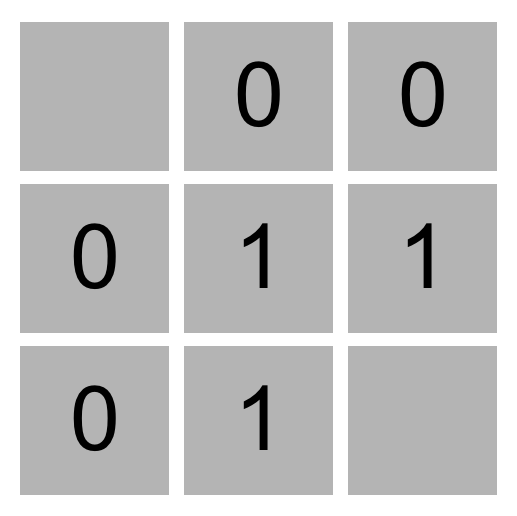
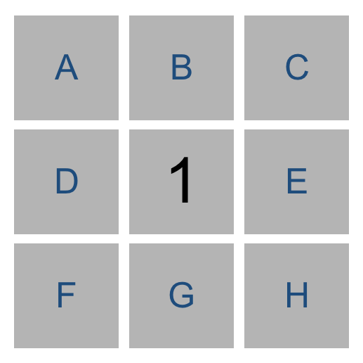
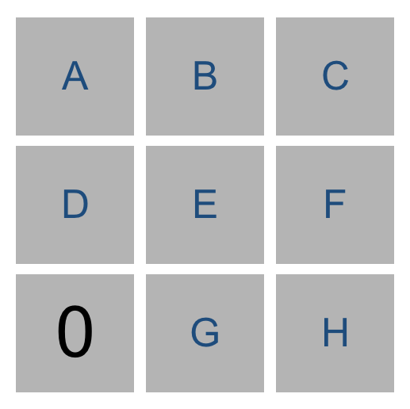
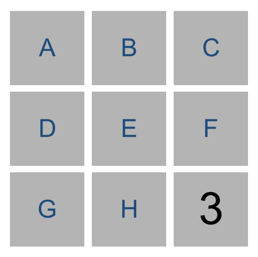
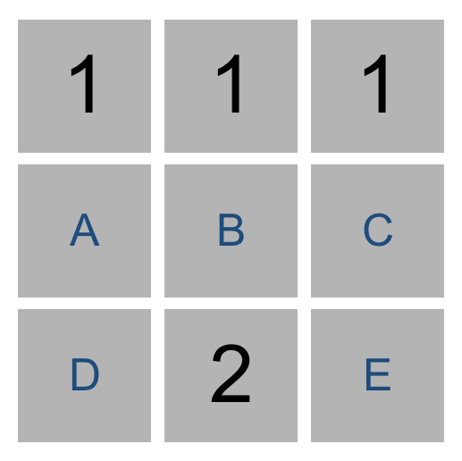

# [Minesweeper](https://cs50.harvard.edu/ai/2020/projects/1/minesweeper/#minesweeper)

Write an AI to play Minesweeper.


## [When to Do It](https://cs50.harvard.edu/ai/2020/projects/1/minesweeper/#when-to-do-it)

By Monday, January 1, 2024, 12:59 PM GMT+8.


## [How to Get Help](https://cs50.harvard.edu/ai/2020/projects/1/minesweeper/#how-to-get-help)

1. Ask questions via [Ed](https://cs50.edx.org/ed)!
2. Ask questions via any of CS50’s [communities](https://cs50.harvard.edu/ai/2020/communities/)!


## [Background](https://cs50.harvard.edu/ai/2020/projects/1/minesweeper/#background)


### [Minesweeper](https://cs50.harvard.edu/ai/2020/projects/1/minesweeper/#minesweeper-1)

Minesweeper is a puzzle game that consists of a grid of cells, where some of the cells contain hidden “mines.” Clicking on a cell that contains a mine detonates the mine, and causes the user to lose the game. Clicking on a “safe” cell (i.e., a cell that does not contain a mine) reveals a number that indicates how many neighboring cells – where a neighbor is a cell that is one square to the left, right, up, down, or diagonal from the given cell – contain a mine.

In this 3x3 Minesweeper game, for example, the three `1` values indicate that each of those cells has one neighboring cell that is a mine. The four `0` values indicate that each of those cells has no neighboring mine.



Given this information, a logical player could conclude that there must be a mine in the lower-right cell and that there is no mine in the upper-left cell, for only in that case would the numerical labels on each of the other cells be accurate.

The goal of the game is to flag (i.e., identify) each of the mines. In many implementations of the game, including the one in this project, the player can flag a mine by right-clicking on a cell (or two-finger clicking, depending on the computer).


### [Propositional Logic](https://cs50.harvard.edu/ai/2020/projects/1/minesweeper/#propositional-logic)

Your goal in this project will be to build an AI that can play Minesweeper. Recall that knowledge-based agents make decisions by considering their knowledge base, and making inferences based on that knowledge.

One way we could represent an AI’s knowledge about a Minesweeper game is by making each cell a propositional variable that is true if the cell contains a mine, and false otherwise.

What information does the AI have access to? Well, the AI would know every time a safe cell is clicked on and would get to see the number for that cell. Consider the following Minesweeper board, where the middle cell has been revealed, and the other cells have been labeled with an identifying letter for the sake of discussion.



What information do we have now? It appears we now know that one of the eight neighboring cells is a mine. Therefore, we could write a logical expression like the below to indicate that one of the neighboring cells is a mine.

```
Or(A, B, C, D, E, F, G, H)
```

But we actually know more than what this expression says. The above logical sentence expresses the idea that at least one of those eight variables is true. But we can make a stronger statement than that: we know that ***exactly\*** one of the eight variables is true. This gives us a propositional logic sentence like the below.

```
Or(
    And(A, Not(B), Not(C), Not(D), Not(E), Not(F), Not(G), Not(H)),
    And(Not(A), B, Not(C), Not(D), Not(E), Not(F), Not(G), Not(H)),
    And(Not(A), Not(B), C, Not(D), Not(E), Not(F), Not(G), Not(H)),
    And(Not(A), Not(B), Not(C), D, Not(E), Not(F), Not(G), Not(H)),
    And(Not(A), Not(B), Not(C), Not(D), E, Not(F), Not(G), Not(H)),
    And(Not(A), Not(B), Not(C), Not(D), Not(E), F, Not(G), Not(H)),
    And(Not(A), Not(B), Not(C), Not(D), Not(E), Not(F), G, Not(H)),
    And(Not(A), Not(B), Not(C), Not(D), Not(E), Not(F), Not(G), H)
)
```

That’s quite a complicated expression! And that’s just to express what it means for a cell to have a `1` in it. If a cell has a `2` or `3` or some other value, the expression could be even longer.

Trying to perform model checking on this type of problem, too, would quickly become intractable: on an 8x8 grid, the size Microsoft uses for its Beginner level, we’d have 64 variables, and therefore 2^64 possible models to check – far too many for a computer to compute in any reasonable amount of time. We need a better representation of knowledge for this problem.


### [Knowledge Representation](https://cs50.harvard.edu/ai/2020/projects/1/minesweeper/#knowledge-representation)

Instead, we’ll represent each sentence of our AI’s knowledge like the below.

```
{A, B, C, D, E, F, G, H} = 1
```

Every logical sentence in this representation has two parts: a set of `cells` on the board that are involved in the sentence, and a number `count`, representing the count of how many of those cells are mines. The above logical sentence says that out of cells A, B, C, D, E, F, G, and H, exactly 1 of them is a mine.

Why is this a useful representation? In part, it lends itself well to certain types of inference. Consider the game below.



Using the knowledge from the lower-left number, we could construct the sentence `{D, E, G} = 0` to mean that out of cells D, E, and G, exactly 0 of them are mines. Intuitively, we can infer from that sentence that all of the cells must be safe. By extension, any time we have a sentence whose `count` is `0`, we know that all of that sentence’s `cells` must be safe.

Similarly, consider the game below.



Our AI would construct the sentence `{E, F, H} = 3`. Intuitively, we can infer that all of E, F, and H are mines. More generally, any time the number of `cells` is equal to the `count`, we know that all of that sentence’s `cells` must be mines.

In general, we’ll only want our sentences to be about `cells` that are not yet known to be either safe or mines. This means that, once we know whether a cell is a mine or not, we can update our sentences to simplify them and potentially draw new conclusions.

For example, if our AI knew the sentence `{A, B, C} = 2`, we don’t yet have enough information to conclude anything. But if we were told that C were safe, we could remove `C` from the sentence altogether, leaving us with the sentence `{A, B} = 2` (which, incidentally, does let us draw some new conclusions.)

Likewise, if our AI knew the sentence `{A, B, C} = 2`, and we were told that C is a mine, we could remove `C` from the sentence and decrease the value of `count` (since C was a mine that contributed to that count), giving us the sentence `{A, B} = 1`. This is logical: if two out of A, B, and C are mines, and we know that C is a mine, then it must be the case that out of A and B, exactly one of them is a mine.

If we’re being even more clever, there’s one final type of inference we can do.



Consider just the two sentences our AI would know based on the top middle cell and the bottom middle cell. From the top middle cell, we have `{A, B, C} = 1`. From the bottom middle cell, we have `{A, B, C, D, E} = 2`. Logically, we could then infer a new piece of knowledge, that `{D, E} = 1`. After all, if two of A, B, C, D, and E are mines, and only one of A, B, and C are mines, then it stands to reason that exactly one of D and E must be the other mine.

More generally, any time we have two sentences `set1 = count1` and `set2 = count2` where `set1` is a subset of `set2`, then we can construct the new sentence `set2 - set1 = count2 - count1`. Consider the example above to ensure you understand why that’s true.

So using this method of representing knowledge, we can write an AI agent that can gather knowledge about the Minesweeper board, and hopefully select cells it knows to be safe!


## [Getting Started](https://cs50.harvard.edu/ai/2020/projects/1/minesweeper/#getting-started)

- Download the distribution code from https://cdn.cs50.net/ai/2020/x/projects/1/minesweeper.zip and unzip it.
- Once in the directory for the project, run `pip3 install -r requirements.txt` to install the required Python package (`pygame`) for this project if you don’t already have it installed.


## [Understanding](https://cs50.harvard.edu/ai/2020/projects/1/minesweeper/#understanding)

There are two main files in this project: `runner.py` and `minesweeper.py`. `minesweeper.py` contains all of the logic the game itself and for the AI to play the game. `runner.py` has been implemented for you, and contains all of the code to run the graphical interface for the game. Once you’ve completed all the required functions in `minesweeper.py`, you should be able to run `python runner.py` to play Minesweeper (or let your AI play for you)!

Let’s open up `minesweeper.py` to understand what’s provided. There are three classes defined in this file, `Minesweeper`, which handles the gameplay; `Sentence`, which represents a logical sentence that contains both a set of `cells` and a `count`; and `MinesweeperAI`, which handles inferring which moves to make based on knowledge.

The `Minesweeper` class has been entirely implemented for you. Notice that each cell is a pair `(i, j)` where `i` is the row number (ranging from `0` to `height - 1`) and `j` is the column number (ranging from `0` to `width - 1`).

The `Sentence` class will be used to represent logical sentences of the form described in the Background. Each sentence has a set of `cells` within it and a `count` of how many of those cells are mines. The class also contains functions `known_mines` and `known_safes` for determining if any of the cells in the sentence are known to be mines or known to be safe. It also contains functions `mark_mine` and `mark_safe` to update a sentence in response to new information about a cell.

Finally, the `MinesweeperAI` class will implement an AI that can play Minesweeper. The AI class keeps track of a number of values. `self.moves_made` contains a set of all cells already clicked on, so the AI knows not to pick those again. `self.mines` contains a set of all cells known to be mines. `self.safes` contains a set of all cells known to be safe. And `self.knowledge` contains a list of all of the `Sentence`s that the AI knows to be true.

The `mark_mine` function adds a cell to `self.mines`, so the AI knows that it is a mine. It also loops over all sentences in the AI’s `knowledge` and informs each sentence that the cell is a mine, so that the sentence can update itself accordingly if it contains information about that mine. The `mark_safe` function does the same thing, but for safe cells instead.

The remaining functions, `add_knowledge`, `make_safe_move`, and `make_random_move`, are left up to you!


## [Specification](https://cs50.harvard.edu/ai/2020/projects/1/minesweeper/#specification)

An automated tool assists the staff in enforcing the constraints in the below specification. Your submission will fail if any of these are not handled properly, if you import modules other than those explicitly allowed, if you hardcode the solution, or if you modify functions other than as permitted.

Complete the implementations of the `Sentence` class and the `MinesweeperAI` class in `minesweeper.py`.

In the `Sentence` class, complete the implementations of `known_mines`, `known_safes`, `mark_mine`, and `mark_safe`.

- The `known_mines` function should return a set of all of the cells in `self.cells` that are known to be mines.
- The `known_safes` function should return a set of all the cells in `self.cells` that are known to be safe.
- The `mark_mine` function should first check to see if `cell` is one of the cells included in the sentence.
    - If `cell` is in the sentence, the function should update the sentence so that `cell` is no longer in the sentence, but still represents a logically correct sentence given that `cell` is known to be a mine.
    - If `cell` is not in the sentence, then no action is necessary.
- The `mark_safe` function should first check to see if `cell` is one of the cells included in the sentence.
    - If `cell` is in the sentence, the function should update the sentence so that `cell` is no longer in the sentence, but still represents a logically correct sentence given that `cell` is known to be safe.
    - If `cell` is not in the sentence, then no action is necessary.

In the `MinesweeperAI` class, complete the implementations of `add_knowledge`, `make_safe_move`, and `make_random_move`.

- `add_knowledge` should accept a `cell` (represented as a tuple `(i, j)`) and its corresponding `count`, and update `self.mines`, `self.safes`,`self.moves_made`, and `self.knowledge` with any new information that the AI can infer, given that `cell` is known to be a safe cell with `count` mines neighboring it.
    - The function should mark the `cell` as one of the moves made in the game.
    - The function should mark the `cell` as a safe cell, updating any sentences that contain the `cell` as well.
    - The function should add a new sentence to the AI’s knowledge base, based on the value of `cell` and `count`, to indicate that `count` of the `cell`’s neighbors are mines. Be sure to only include cells whose state is still undetermined in the sentence.
    - If, based on any of the sentences in `self.knowledge`, new cells can be marked as safe or as mines, then the function should do so.
    - If, based on any of the sentences in `self.knowledge`, new sentences can be inferred (using the subset method described in the Background), then those sentences should be added to the knowledge base as well.
    - Note that any time that you make any change to your AI’s knowledge, it may be possible to draw new inferences that weren’t possible before. Be sure that those new inferences are added to the knowledge base if it is possible to do so.
- `make_safe_move` should return a move `(i, j)` that is known to be safe.
    - The move returned must be known to be safe, and not a move already made.
    - If no safe move can be guaranteed, the function should return `None`.
    - The function should not modify `self.moves_made`, `self.mines`, `self.safes`, or `self.knowledge`.
- `make_random_move` should return a random move `(i, j)`.
    - This function will be called if a safe move is not possible: if the AI doesn’t know where to move, it will choose to move randomly instead.
    - The move must not be a move that has already been made.
    - The move must not be a move that is known to be a mine.
    - If no such moves are possible, the function should return `None`.


## [Hints](https://cs50.harvard.edu/ai/2020/projects/1/minesweeper/#hints)

- Be sure you’ve thoroughly read the Background section to understand how knowledge is represented in this AI and how the AI can make inferences.
- If feeling less comfortable with object-oriented programming, you may find [Python’s documentation on classes](https://docs.python.org/3/tutorial/classes.html) helpful.
- You can find some common `set` operations in [Python’s documentation on sets](https://docs.python.org/3/library/stdtypes.html#set).
- When implementing `known_mines` and `known_safes` in the `Sentence` class, consider: under what circumstances do you know for sure that a sentence’s cells are safe? Under what circumstances do you know for sure that a sentence’s cells are mines?
- `add_knowledge` does quite a lot of work, and will likely be the longest function you write for this project by far. It will likely be helpful to implement this function’s behavior one step at a time.
- You’re welcome to add new methods to any of the classes if you would like, but you should not modify any of the existing functions’ definitions or arguments.
- When you run your AI (as by clicking “AI Move”), note that it will not always win! There will be some cases where the AI must guess, because it lacks sufficient information to make a safe move. This is to be expected. `runner.py` will print whether the AI is making a move it believes to be safe or whether it is making a random move.
- Be careful not to modify a set while iterating over it. Doing so may result in errors!


## [How to Submit](https://cs50.harvard.edu/ai/2020/projects/1/minesweeper/#how-to-submit)

You may not have your code in your `ai50/projects/2020/x/minesweeper` branch nested within any further subdirectories (such as a subdirectory called `minesweeper` or `project1b`). That is to say, if the staff attempts to access `https://github.com/me50/USERNAME/blob/ai50/projects/2020/x/minesweeper/minesweeper.py`, where `USERNAME` is your GitHub username, that is exactly where your file should live. If your file is not at that location when the staff attempts to grade, your submission will fail.

1. Visit [this link](https://submit.cs50.io/invites/8f7fa48876984cda98a73ba53bcf01fd), log in with your GitHub account, and click **Authorize cs50**. Then, check the box indicating that you’d like to grant course staff access to your submissions, and click **Join course**.

2. [Install Git](https://git-scm.com/downloads) and, optionally, [install `submit50`](https://cs50.readthedocs.io/submit50/).

3. If you’ve installed `submit50`, execute

    ```
    submit50 ai50/projects/2020/x/minesweeper
    ```

    Otherwise, using Git, push your work to `https://github.com/me50/USERNAME.git`, where `USERNAME` is your GitHub username, on a branch called `ai50/projects/2020/x/minesweeper`.

4. Submit [this form](https://forms.cs50.io/b92a80cf-bf1b-44d9-a4fd-b8c91a648f6b).

You can then go to https://cs50.me/cs50ai to view your current progress!