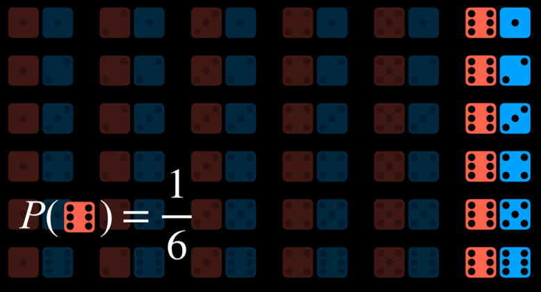

# [Lecture 2](https://cs50.harvard.edu/ai/2020/notes/2/#lecture-2)


## [Uncertainty](https://cs50.harvard.edu/ai/2020/notes/2/#uncertainty)

Last lecture, we discussed how AI can represent and derive new knowledge. However, often, in reality, the AI has only partial knowledge of the world, leaving space for uncertainty. Still, we would like our AI to make the best possible decision in these situations. For example, when predicting weather, the AI has information about the weather today, but there is no way to predict with 100% accuracy the weather tomorrow. Still, we can do better than chance, and today’s lecture is about how we can create AI that makes optimal decisions given limited information and uncertainty.


## [Probability](https://cs50.harvard.edu/ai/2020/notes/2/#probability)

Uncertainty can be represented as a number of events and the likelihood, or probability, of each of them happening.

**Possible Worlds**

Every possible situation can be thought of as a world, represented by the lowercase Greek letter omega ω. For example, rolling a die can result in six possible worlds: a world where the die yields a 1, a world where the die yields a 2, and so on. To represent the probability of a certain world, we write P(*ω*).

**Axioms in Probability**

- 0 < P(ω) < 1: every value representing probability must range between 0 and 1.
    - Zero is an impossible event, like rolling a standard die and getting a 7.
    - One is an event that is certain to happen, like rolling a standard die and getting a value less than 10.
    - In general, the higher the value, the more likely the event is to happen.
- The probabilities of every possible event, when summed together, are equal to 1.


The probability of rolling a number *R* with a standard die can be represented as P(*R*). In our case, P(*R*) = 1/6, because there are six possible worlds (rolling any number from 1 through 6) and each is equally likely to happen. Now, consider the event of rolling two dice. Now, there are 36 possible events, which are, again, equally as likely.


However, what happens if we try to predict the sum of the two dice? In this case, we have only 11 possible values (the sum has to range from 2 to 12), and they do not occur equally as often.


To get the probability of an event, we divide the number of worlds in which it occurs by the number of total possible worlds. For example, there are 36 possible worlds when rolling two dice. Only in one of these worlds, when both dice yield a 6, do we get the sum of 12. Thus, P(*12*) = 1/36, or, in words, the probability of rolling two dice and getting two numbers whose sum is 12 is 1/36. What is P(*7*)? We count and see that the sum 7 occurs in 6 worlds. Thus, P(*7*) = 6/36 = 1/6.

**Unconditional Probability**

Unconditional probability is the degree of belief in a proposition in the absence of any other evidence. All the questions that we have asked so far were questions of unconditional probability, because the result of rolling a die is not dependent on previous events.


## [Conditional Probability](https://cs50.harvard.edu/ai/2020/notes/2/#conditional-probability)

Conditional probability is the degree of belief in a proposition given some evidence that has already been revealed. As discussed in the introduction, AI can use partial information to make educated guesses about the future. To use this information, which affects the probability that the event occurs in the future, we rely on conditional probability.

Conditional probability is expressed using the following notation: P(*a | b*), meaning “the probability of event *a* occurring given that we know event *b* to have occurred,” or, more succinctly, “the probability of *a* given *b*.” Now we can ask questions like what is the probability of rain today given that it rained yesterday P(*rain today | rain yesterday*), or what is the probability of the patient having the disease given their test results P(*disease | test results*).

Mathematically, to compute the conditional probability of *a* given *b*, we use the following formula:


To put it in words, the probability that *a* given *b* is true is equal to the probability of *a* and *b* being true, divided by the probability of *b*. An intuitive way of reasoning about this is the thought “we are interested in the events where both *a* and *b* are true (the numerator), but only from the worlds where we know *b* to be true (the denominator).” Dividing by *b* restricts the possible worlds to the ones where *b* is true. The following are algebraically equivalent forms to the formula above:


For example, consider P(*sum 12 | roll six on one die*), or the probability of rolling two dice and getting a sum of twelve, given that we have already rolled one die and got a six. To calculate this, we first restrict our worlds to the ones where the value of the first die is six:



Now we ask how many times does the event *a* (the sum being 12) occur in the worlds that we restricted the question to (dividing by P(*b*), or the probability of the first die yielding 6).


## [Random Variables](https://cs50.harvard.edu/ai/2020/notes/2/#random-variables)

A random variable is a variable in probability theory with a domain of possible values that it can take on. For example, to represent possible outcomes when rolling a die, we can define a random variable *Roll*, that can take on the values {*0, 1, 2, 3, 4, 5, 6*}. To represent the status of a flight, we can define a variable *Flight* that takes on the values {*on time, delayed, canceled*}.

Often, we are interested in the probability with which each value occurs. We represent this using a probability distribution. For example,

- P(*Flight = on time*) = 0.6
- P(*Flight = delayed*) = 0.3
- P(*Flight = canceled*) = 0.1

To interpret the probability distribution with words, this means that there is a 60% chance that the flight is on time, 30% chance that it is delayed, and 10% chance that it is canceled. Note that, as shown previously, the sum the probabilities of all possible outcomes is 1.

A probability distribution can be represented more succinctly as a vector. For example, **P**(*Flight*) = <*0.6, 0.3, 0.1*>. For this notation to be interpretable, the values have a set order (in our case, *on time, delayed, canceled*).

**Independence**

Independence is the knowledge that the occurrence of one event does not affect the probability of the other event. For example, when rolling two dice, the result of each die is independent from the other. Rolling a 4 with the first die does not influence the value of the second die that we roll. This is opposed to dependent events, like clouds in the morning and rain in the afternoon. If it is cloudy in the morning, it is more likely that it will rain in the morning, so these events are dependent.

Independence can be defined mathematically: events *a* and *b* are independent if and only if the probability of *a* and *b* is equal to the probability of *a* times the probability of *b*: P(*a ∧ b*) = P(*a*)P(*b*).


## [Bayes’ Rule](https://cs50.harvard.edu/ai/2020/notes/2/#bayes-rule)

Bayes’ rule is commonly used in probability theory to compute conditional probability. In words, Bayes’ rule says that the probability of *b* given *a* is equal to the probability of *a* given *b*, times the probability of *b*, divided by the probability of *a*.


For example, we would like to compute the probability of it raining in the afternoon if there are clouds in the morning, or P(*rain | clouds*). We start with the following information:

- 80% of rainy afternoons start with cloudy mornings, or P(*clouds | rain*).
- 40% of days have cloudy mornings, or P(*clouds*).
- 10% of days have rainy afternoons, or P(*rain*).

Applying Bayes’ rule, we compute (0.1)(0.8)/(0.4) = 0.2. That is, the probability that it rains in the afternoon given that it was cloudy in the morning is 20%.

Knowing P(*a | b*), in addition to P(*a*) and P(*b*), allows us to calculate P(*b | a*). This is helpful, because knowing the conditional probability of a visible effect given an unknown cause, P(*visible effect | unknown cause*), allows us to calculate the probability of the unknown cause given the visible effect, P(*unknown cause | visible effect*). For example, we can learn P(*medical test results | disease*) through medical trials, where we test people with the disease and see how often the test picks up on that. Knowing this, we can calculate P(*disease | medical test results*), which is valuable diagnostic information.


## [Joint Probability](https://cs50.harvard.edu/ai/2020/notes/2/#joint-probability)

Joint probability is the likelihood of multiple events all occurring.

Let us consider the following example, concerning the probabilities of clouds in the morning and rain in the afternoon.

| C = *cloud* | C = *¬cloud* |
| ----------- | ------------ |
| 0.4         | 0.6          |

| R = *rain* | R = *¬rain* |
| ---------- | ----------- |
| 0.1        | 0.9         |

Looking at these data, we can’t say whether clouds in the morning are related to the likelihood of rain in the afternoon. To be able to do so, we need to look at the joint probabilities of all the possible outcomes of the two variables. We can represent this in a table as follows:

|              | R = *rain* | R = *¬rain* |
| ------------ | ---------- | ----------- |
| C = *cloud*  | 0.08       | 0.32        |
| C = *¬cloud* | 0.02       | 0.58        |

Now we are able to know information about the co-occurrence of the events. For example, we know that the probability of a certain day having clouds in the morning and rain in the afternoon is 0.08. The probability of no clouds in the morning and no rain in the afternoon is 0.58.

Using joint probabilities, we can deduce conditional probability. For example, if we are interested in the probability distribution of clouds in the morning given rain in the afternoon. P(*C | rain*) = P(*C, rain*)/P(*rain*) (a side note: in probability, commas and ∧ are used interchangeably. Thus, P(*C, rain*) = P(*C ∧ rain*)). In words, we divide the joint probability of rain and clouds by the probability of rain.

In the last equation, it is possible to view P(*rain*) as some constant by which P(*C, rain*) is multiplied. Thus, we can rewrite P(*C, rain*)/P(*rain*) = αP(*C, rain*), or α<0.08, 0.02>. Factoring out α leaves us with the proportions of the probabilities of the possible values of C given that there is rain in the afternoon. Namely, if there is rain in the afternoon, the proportion of the probabilities of clouds in the morning and no clouds in the morning is 0.08:0.02. Note that 0.08 and 0.02 don’t sum up to 1; however, since this is the probability distribution for the random variable C, we know that they should sum up to 1. Therefore, we need to normalize the values by computing α such that α0.08 + α0.02 = 1. Finally, we can say that P(*C | rain*) = <0.8, 0.2>.


## [Probability Rules](https://cs50.harvard.edu/ai/2020/notes/2/#probability-rules)

- **Negation**: P(*¬a*) = 1 - P(*a*). This stems from the fact that the sum of the probabilities of all the possible worlds is 1, and the complementary literals *a* and *¬a* include all the possible worlds.

- **Inclusion-Exclusion**: P(a ∨ b) = P(a) + P(b) - P(a ∧ b). This can interpreted in the following way: the worlds in which a or b are true are equal to all the worlds where a is true, plus the worlds where b is true. However, in this case, some worlds are counted twice (the worlds where both a and b are true)). To get rid of this overlap, we subtract once the worlds where both a and b are true (since they were counted twice).

    > Here is an example from outside lecture that can elucidate this. Suppose I eat ice cream 80% of days and cookies 70% of days. If we’re calculating the probability that today I eat ice cream or cookies P(*ice cream ∨ cookies*) without subtracting P(*ice cream ∧ cookies*), we erroneously end up with ~~0.7 + 0.8 = 1.5~~. This contradicts the axiom that probability ranges between 0 and 1. To correct for counting twice the days when I ate both ice cream and cookies, we need to subtract P(*ice cream ∧ cookies*) once.

- **Marginalization**: P(*a*) = P(*a, b*) + P(*a, ¬b*). The idea here is that *b* and *¬b* are disjoint probabilities. That is, the probability of *b* and *¬b* occurring at the same time is 0. We also know *b* and *¬b* sum up to 1. Thus, when *a* happens, *b* can either happen or not. When we take the probability of both *a* and *b* happening in addition to the probability of *a* and *¬b*, we end up with simply the probability of *a*.

Marginalization can be expressed for random variables the following way:


The left side of the equation means “The probability of random variable X having the value xᵢ.” For example, for the variable C we mentioned earlier, the two possible values are *clouds in the morning* and *no clouds in the morning*. The right part of the equation is the idea of marginalization. P(*X = xᵢ*) is equal to the sum of all the joint probabilities of xᵢ and every single value of the random variable Y. For example, P(*C = cloud*) = P(*C = cloud, R = rain*) + P(*C = cloud, R = ¬rain*) = 0.08 + 0.32 = 0.4.

- **Conditioning**: P(*a*) = P(*a | b*)P(*b*) + P(*a | ¬b*)P(*¬b*). This is a similar idea to marginalization. The probability of event *a* occurring is equal to the probability of *a* given *b* times the probability of *b*, plus the probability of *a* given *¬b* time the probability of *¬b*.


In this formula, the random variable X takes the value xᵢ with probability that is equal to the sum of the probabilities of xᵢ given each value of the random variable Y multiplied by the probability of variable Y taking that value. This makes sense if we remember that P(*a | b*) = P(*a, b*)/P(*b*). If we multiply this expression by P(*b*), we end up with P(*a, b*), and from here we do the same as we did with marginalization.


## [Bayesian Networks](https://cs50.harvard.edu/ai/2020/notes/2/#bayesian-networks)

A Bayesian network is a data structure that represents the dependencies among random variables. Bayesian networks have the following properties:

- They are directed graphs.
- Each node on the graph represent a random variable.
- An arrow from X to Y represents that X is a parent of Y. That is, the probability distribution of Y depends on the value of X.
- Each node X has probability distribution P(*X | Parents(X)*).

Let’s consider an example of a Bayesian network that involves variables that affect whether we get to our appointment on time.


Let’s describe this Bayesian network from the top down:

- Rain is the root node in this network. This means that its probability distribution is not reliant on any prior event. In our example, Rain is a random variable that can take the values {*none, light, heavy*} with the following probability distribution:

    | *none* | *light* | *heavy* |
    | ------ | ------- | ------- |
    | 0.7    | 0.2     | 0.1     |

    

- Maintenance, in our example, encodes whether there is train track maintenance, taking the values {*yes, no*}. Rain is a parent node of Maintenance, which means that the probability distribution of Maintenance is affected by Rain.

    | R       | *yes* | *no* |
    | ------- | ----- | ---- |
    | *none*  | 0.4   | 0.6  |
    | *light* | 0.2   | 0.8  |
    | *heavy* | 0.1   | 0.9  |

    

- Train is the variable that encodes whether the train is on time or delayed, taking the values {*on time, delayed*}. Note that Train has arrows pointing to it from both Maintenance and Rain. This means that both are parents of Train, and their values affect the probability distribution of Train.

    | R       | M    | *on time* | *delayed* |
    | ------- | ---- | --------- | --------- |
    | *none*  | yes  | 0.8       | 0.2       |
    | *none*  | no   | 0.9       | 0.1       |
    | *light* | yes  | 0.6       | 0.4       |
    | *light* | no   | 0.7       | 0.3       |
    | *heavy* | yes  | 0.4       | 0.6       |
    | *heavy* | no   | 0.5       | 0.5       |

    

- Appointment is a random variable that represents whether we attend our appointment, taking the values {*attend, miss*}. Note that its only parent is Train. This point about Bayesian network is noteworthy: parents include only direct relations. It is true that maintenance affects whether the train is on time, and whether the train is on time affects whether we attend the appointment. However, in the end, what directly affects our chances of attending the appointment is whether the train came on time, and this is what is represented in the Bayesian network. For example, if the train came on time, it could be heavy rain and track maintenance, but that has no effect over whether we made it to our appointment.

    | T         | *attend* | *miss* |
    | --------- | -------- | ------ |
    | *on time* | 0.9      | 0.1    |
    | *delayed* | 0.6      | 0.4    |

    

For example, if we want to find the probability of missing the meeting when the train was delayed on a day with no maintenance and light rain, or P(*light, no, delayed, miss*), we will compute the following: P(*light*)P(*no | light*)P(*delayed | light, no*)P(*miss | delayed*). The value of each of the individual probabilities can be found in the probability distributions above, and then these values are multiplied to produce P(*no, light, delayed, miss*).

**Inference**

At the last lecture, we looked at inference through entailment. This means that we could definitively conclude new information based on the information that we already had. We can also infer new information based on probabilities. While this does not allow us to know new information for certain, it allows us to figure out the probability distributions for some values. Inference has multiple properties.

- Query **X**: the variable for which we want to compute the probability distribution.
- Evidence variables **E**: one or more variables that have been observed for event **e**. For example, we might have observed that there is light rain, and this observation helps us compute the probability that the train is delayed.
- Hidden variables **Y**: variables that aren’t the query and also haven’t been observed. For example, standing at the train station, we can observe whether there is rain, but we can’t know if there is maintenance on the track further down the road. Thus, Maintenance would be a hidden variable in this situation.
- The goal: calculate **P**(*X | e*). For example, compute the probability distribution of the Train variable (the query) based on the evidence **e** that we know there is light rain.

Let’s take an example. We want to compute the probability distribution of the Appointment variable given the evidence that there is light rain and no track maintenance. That is, we know that there is light rain and no track maintenance, and we want to figure out what are the probabilities that we attend the appointment and that we miss the appointment, **P**(*Appointment | light, no*). from the [joint probability](https://cs50.harvard.edu/ai/2020/notes/2/#joint-probability) section, we know that we can express the possible values of the Appointment random variable as a proportion, rewriting **P**(*Appointment | light, no*) as αP(*Appointment, light, no*). How can we calculate the probability distribution of Appointment if its parent is only the Train variable, and not Rain or Maintenance? Here, we will use marginalization. The value of **P**(*Appointment, light, no*) is equal to α[**P**(*Appointment, light, no, delayed*) + **P**(*Appointment, light, no, on time*)].

**Inference by Enumeration**

Inference by enumeration is a process of finding the probability distribution of variable X given observed evidence e and some hidden variables Y.


In this equation, X stand for the query variable, e for the observed evidence, y for all the values of the hidden variables, and α normalizes the result such that we end up with probabilities that add up to 1. To explain the equation in words, it is saying that the probability distribution of X given e is equal to a normalized probability distribution of X and e. To get to this distribution, we sum the normalized probability of X, e, and y, where y takes each time a different value of the hidden variables Y.

Multiple libraries exist in Python to ease the process of probabilistic inference. We will take a look at the library *pomegranate* to see how the above data can be represented in code.

First, we create the nodes and provide a probability distribution for each one.

```python
from pomegranate import *

# Rain node has no parents
rain = Node(DiscreteDistribution({
    "none": 0.7,
    "light": 0.2,
    "heavy": 0.1
}), name="rain")

# Track maintenance node is conditional on rain
maintenance = Node(ConditionalProbabilityTable([
    ["none", "yes", 0.4],
    ["none", "no", 0.6],
    ["light", "yes", 0.2],
    ["light", "no", 0.8],
    ["heavy", "yes", 0.1],
    ["heavy", "no", 0.9]
], [rain.distribution]), name="maintenance")

# Train node is conditional on rain and maintenance
train = Node(ConditionalProbabilityTable([
    ["none", "yes", "on time", 0.8],
    ["none", "yes", "delayed", 0.2],
    ["none", "no", "on time", 0.9],
    ["none", "no", "delayed", 0.1],
    ["light", "yes", "on time", 0.6],
    ["light", "yes", "delayed", 0.4],
    ["light", "no", "on time", 0.7],
    ["light", "no", "delayed", 0.3],
    ["heavy", "yes", "on time", 0.4],
    ["heavy", "yes", "delayed", 0.6],
    ["heavy", "no", "on time", 0.5],
    ["heavy", "no", "delayed", 0.5],
], [rain.distribution, maintenance.distribution]), name="train")

# Appointment node is conditional on train
appointment = Node(ConditionalProbabilityTable([
    ["on time", "attend", 0.9],
    ["on time", "miss", 0.1],
    ["delayed", "attend", 0.6],
    ["delayed", "miss", 0.4]
], [train.distribution]), name="appointment")
```

Second, we create the model by adding all the nodes and then describing which node is the parent of which other node by adding edges between them (recall that a Bayesian network is a directed graph, consisting of nodes with arrows between them).

```python
# Create a Bayesian Network and add states
model = BayesianNetwork()
model.add_states(rain, maintenance, train, appointment)

# Add edges connecting nodes
model.add_edge(rain, maintenance)
model.add_edge(rain, train)
model.add_edge(maintenance, train)
model.add_edge(train, appointment)

# Finalize model
model.bake()
```

Now, to ask how probable a certain event is, we run the model with the values we are interested in. In this example, we want to ask what is the probability that there is no rain, no track maintenance, the train is on time, and we attend the meeting.

```python
# Calculate probability for a given observation
probability = model.probability([["none", "no", "on time", "attend"]])

print(probability)
```

Otherwise, we could use the program to provide probability distributions for all variables given some observed evidence. In the following case, we know that the train was delayed. Given this information, we compute and print the probability distributions of the variables Rain, Maintenance, and Appointment.

```python
# Calculate predictions based on the evidence that the train was delayed
predictions = model.predict_proba({
    "train": "delayed"
})

# Print predictions for each node
for node, prediction in zip(model.states, predictions):
    if isinstance(prediction, str):
        print(f"{node.name}: {prediction}")
    else:
        print(f"{node.name}")
        for value, probability in prediction.parameters[0].items():
            print(f"    {value}: {probability:.4f}")
```

The code above used inference by enumeration. However, this way of computing probability is inefficient, especially when there are many variables in the model. A different way to go about this would be abandoning **exact inference** in favor of **approximate inference**. Doing this, we lose some precision in the generated probabilities, but often this imprecision is negligible. Instead, we gain a scalable method of calculating probabilities.


## [Sampling](https://cs50.harvard.edu/ai/2020/notes/2/#sampling)

Sampling is one technique of approximate inference. In sampling, each variable is sampled for a value according to its probability distribution. We will start with an example from outside lecture, and then cover the example from lecture.

> To generate a distribution using sampling with a die, we can roll the die multiple times and record what value we got each time. Suppose we rolled the die 600 times. We count how many times we got 1, which is supposed to be roughly 100, and then repeat for the rest of the values, 2-6. Then, we divide each count by the total number of rolls. This will generate an approximate distribution of the values of rolling a die: on one hand, it is unlikely that we get the result that each value has a probability of 1/6 of occurring (which is the exact probability), but we will get a value that’s close to it.

Here is an example from lecture: if we start with sampling the Rain variable, the value *none* will be generated with probability of 0.7, the value *light* will be generated with probability of 0.2, and the value *heavy* will be generated with probability of 0.1. Suppose that the sampled value we get is *none*. When we get to the Maintenance variable, we sample it, too, but only from the probability distribution where Rain is equal to *none*, because this is an already sampled result. We will continue to do so through all the nodes. Now we have one sample, and repeating this process multiple times generates a distribution. Now, if we want to answer a question, such as what is P(*Train = on time*), we can count the number of samples where the variable Train has the value *on time*, and divide the result by the total number of samples. This way, we have just generated an approximate probability for P(*Train = on time*).

We can also answer questions that involve conditional probability, such as P(*Rain = light | Train = on time*). In this case, we ignore all samples where the value of Train is not *on time*, and then proceed as before. We count how many samples have the variable Rain = *light* among those samples that have Train = *on time*, and then divide by the total number of samples where Train = *on time*.

In code, a sampling function can look like `generate_sample`:

```python
import pomegranate

from collections import Counter

from model import model

def generate_sample():

    # Mapping of random variable name to sample generated
    sample = {}

    # Mapping of distribution to sample generated
    parents = {}

    # Loop over all states, assuming topological order
    for state in model.states:

        # If we have a non-root node, sample conditional on parents
        if isinstance(state.distribution, pomegranate.ConditionalProbabilityTable):
            sample[state.name] = state.distribution.sample(parent_values=parents)

        # Otherwise, just sample from the distribution alone
        else:
            sample[state.name] = state.distribution.sample()

        # Keep track of the sampled value in the parents mapping
        parents[state.distribution] = sample[state.name]

    # Return generated sample
    return sample
```

Now, to compute P(*Appointment | Train = delayed*), which is the probability distribution of the Appointment variable given that the train is delayed, we do the following:

```python
# Rejection sampling
# Compute distribution of Appointment given that train is delayed
N = 10000
data = []

# Repeat sampling 10,000 times
for i in range(N):

    # Generate a sample based on the function that we defined earlier
    sample = generate_sample()

    # If, in this sample, the variable of Train has the value delayed, save the sample. Since we are interested interested in the probability distribution of Appointment given that the train is delayed, we discard the sampled where the train was on time.
    if sample["train"] == "delayed":
        data.append(sample["appointment"])

# Count how many times each value of the variable appeared. We can later normalize by dividing the results by the total number of saved samples to get the approximate probabilities of the variable that add up to 1.
print(Counter(data))
```

**Likelihood Weighting**

In the sampling example above, we discarded the samples that did not match the evidence that we had. This is inefficient. One way to get around this is with likelihood weighting, using the following steps:

- Start by fixing the values for evidence variables.
- Sample the non-evidence variables using conditional probabilities in the Bayesian network.
- Weight each sample by its **likelihood**: the probability of all the evidence occurring.

For example, if we have the observation that the train was on time, we will start sampling as before. We sample a value of Rain given its probability distribution, then Maintenance, but when we get to Train - we always give it the observed value, in our case, *on time*. Then we proceed and sample Appointment based on its probability distribution given Train = *on time*. Now that this sample exists, we weight it by the conditional probability of the observed variable given its sampled parents. That is, if we sampled Rain and got *light*, and then we sampled Maintenance and got *yes*, then we will weight this sample by P(*Train = on time | light, yes*).


## [Markov Models](https://cs50.harvard.edu/ai/2020/notes/2/#markov-models)

So far, we have looked at questions of probability given some information that we observed. In this kind of paradigm, the dimension of time is not represented in any way. However, many tasks do rely on the dimension of time, such as prediction. To represent the variable of time we will create a new variable, X, and change it based on the event of interest, such that Xₜ is the current event, Xₜ₊₁ is the next event, and so on. To be able to predict events in the future, we will use Markov Models.

**The Markov Assumption**

The Markov assumption is an assumption that the current state depends on only a finite fixed number of previous states. This is important to us. Think of the task of predicting weather. In theory, we could use all the data from the past year to predict tomorrow’s weather. However, it is infeasible, both because of the computational power this would require and because there is probably no information about the conditional probability of tomorrow’s weather based on the weather 365 days ago. Using the Markov assumption, we restrict our previous states (e.g. how many previous days we are going to consider when predicting tomorrow’s weather), thereby making the task manageable. This means that we might get a more rough approximation of the probabilities of interest, but this is often good enough for our needs. Moreover, we can use a Markov model based on the information of the one last event (e.g. predicting tomorrow’s weather based on today’s weather).

**Markov Chain**

A Markov chain is a sequence of random variables where the distribution of each variable follows the Markov assumption. That is, each event in the chain occurs based on the probability of the event before it.

To start constructing a Markov chain, we need a **transition model** that will specify the the probability distributions of the next event based on the possible values of the current event.


In this example, the probability of tomorrow being sunny based on today being sunny is 0.8. This is reasonable, because it is more likely than not that a sunny day will follow a sunny day. However, if it is rainy today, the probability of rain tomorrow is 0.7, since rainy days are more likely to follow each other. Using this transition model, it is possible to sample a Markov chain. Start with a day being either rainy or sunny, and then sample the next day based on the probability of it being sunny or rainy given the weather today. Then, condition the probability of the day after tomorrow based on tomorrow, and so on, resulting in a Markov chain:


Given this Markov chain, we can now answer questions such as “what is the probability of having four rainy days in a row?” Here is an example of how a Markov chain can be implemented in code:

```python
from pomegranate import *

# Define starting probabilities
start = DiscreteDistribution({
    "sun": 0.5,
    "rain": 0.5
})

# Define transition model
transitions = ConditionalProbabilityTable([
    ["sun", "sun", 0.8],
    ["sun", "rain", 0.2],
    ["rain", "sun", 0.3],
    ["rain", "rain", 0.7]
], [start])

# Create Markov chain
model = MarkovChain([start, transitions])

# Sample 50 states from chain
print(model.sample(50))
```


## [Hidden Markov Models](https://cs50.harvard.edu/ai/2020/notes/2/#hidden-markov-models)

A hidden Markov model is a type of a Markov model for a system with hidden states that generate some observed event. This means that sometimes, the AI has some measurement of the world but no access to the precise state of the world. In these cases, the state of the world is called the **hidden state** and whatever data the AI has access to are the **observations**. Here are a few examples for this:

- For a robot exploring uncharted territory, the hidden state is its position, and the observation is the data recorded by the robot’s sensors.
- In speech recognition, the hidden state is the words that were spoken, and the observation is the audio waveforms.
- When measuring user engagement on websites, the hidden state is how engaged the user is, and the observation is the website or app analytics.

For our discussion, we will use the following example. Our AI wants to infer the weather (the hidden state), but it only has access to an indoor camera that records how many people brought umbrellas with them. Here is our **sensor model** (also called **emission model**) that represents these probabilities:


In this model, if it is sunny, it is most probable that people will not bring umbrellas to the building. If it is rainy, then it is very likely that people bring umbrellas to the building. By using the observation of whether people brought an umbrella or not, we can predict with reasonable likelihood what the weather is outside.

**Sensor Markov Assumption**

The assumption that the evidence variable depends only on the corresponding state. For example, for our models, we assume that whether people bring umbrellas to the office depends only on the weather. This is not necessarily reflective of the complete truth, because, for example, more conscientious, rain-averse people might take an umbrella with them everywhere even when it is sunny, and if we knew everyone’s personalities it would add more data to the model. However, the sensor Markov assumption ignores these data, assuming that only the hidden state affects the observation.

A hidden Markov model can be represented in a Markov chain with two layers. The top layer, variable X, stands for the hidden state. The bottom layer, variable E, stands for the evidence, the observations that we have.


Based on hidden Markov models, multiple tasks can be achieved:

- Filtering: given observations from start until now, calculate the probability distribution for the current state. For example, given information on when people bring umbrellas form the start of time until today, we generate a probability distribution for whether it is raining today or not.
- Prediction: given observations from start until now, calculate the probability distribution for a future state.
- Smoothing: given observations from start until now, calculate the probability distribution for a past state. For example, calculating the probability of rain yesterday given that people brought umbrellas today.
- Most likely explanation: given observations from start until now, calculate most likely sequence of events.

The most likely explanation task can be used in processes such as voice recognition, where, based on multiple waveforms, the AI infers the most likely sequence of words or syllables that brought to these waveforms. Next is a Python implementation of a hidden Markov model that we will use for a most likely explanation task:

```python
from pomegranate import *

# Observation model for each state
sun = DiscreteDistribution({
    "umbrella": 0.2,
    "no umbrella": 0.8
})

rain = DiscreteDistribution({
    "umbrella": 0.9,
    "no umbrella": 0.1
})

states = [sun, rain]

# Transition model
transitions = numpy.array(
    [[0.8, 0.2], # Tomorrow's predictions if today = sun
     [0.3, 0.7]] # Tomorrow's predictions if today = rain
)

# Starting probabilities
starts = numpy.array([0.5, 0.5])

# Create the model
model = HiddenMarkovModel.from_matrix(
    transitions, states, starts,
    state_names=["sun", "rain"]
)
model.bake()
```

Note that our model has both the sensor model and the transition model. We need both for the hidden Markov model. In the following code snippet, we see a sequence of observations of whether people brought umbrellas to the building or not, and based on this sequence we will run the model, which will generate and print the most likely explanation (i.e. the weather sequence that most likely brought to this pattern of observations):

```python
from model import model

# Observed data
observations = [
    "umbrella",
    "umbrella",
    "no umbrella",
    "umbrella",
    "umbrella",
    "umbrella",
    "umbrella",
    "no umbrella",
    "no umbrella"
]

# Predict underlying states
predictions = model.predict(observations)
for prediction in predictions:
    print(model.states[prediction].name)
```

In this case, the output of the program will be rain, rain, sun, rain, rain, rain, rain, sun, sun. This output represents what is the most likely pattern of weather given our observations of people bringing or not bringing umbrellas to the building.