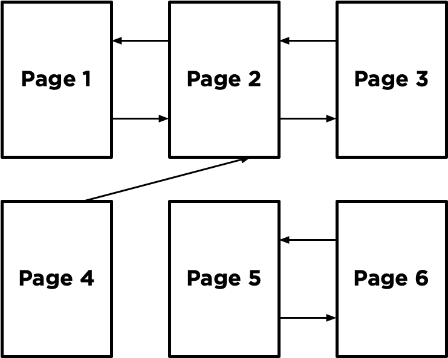

# [PageRank](https://cs50.harvard.edu/ai/2020/projects/2/pagerank/#pagerank)

Write an AI to rank web pages by importance.

```
$ python pagerank.py corpus0
PageRank Results from Sampling (n = 10000)
  1.html: 0.2223
  2.html: 0.4303
  3.html: 0.2145
  4.html: 0.1329
PageRank Results from Iteration
  1.html: 0.2202
  2.html: 0.4289
  3.html: 0.2202
  4.html: 0.1307
```


## [When to Do It](https://cs50.harvard.edu/ai/2020/projects/2/pagerank/#when-to-do-it)

By Monday, January 1, 2024, 12:59 PM GMT+8.


## [How to Get Help](https://cs50.harvard.edu/ai/2020/projects/2/pagerank/#how-to-get-help)

1. Ask questions via [Ed](https://cs50.edx.org/ed)!
2. Ask questions via any of CS50’s [communities](https://cs50.harvard.edu/ai/2020/communities/)!


## [Background](https://cs50.harvard.edu/ai/2020/projects/2/pagerank/#background)

When search engines like Google display search results, they do so by placing more “important” and higher-quality pages higher in the search results than less important pages. But how does the search engine know which pages are more important than other pages?

One heuristic might be that an “important” page is one that many other pages link to, since it’s reasonable to imagine that more sites will link to a higher-quality webpage than a lower-quality webpage. We could therefore imagine a system where each page is given a rank according to the number of incoming links it has from other pages, and higher ranks would signal higher importance.

But this definition isn’t perfect: if someone wants to make their page seem more important, then under this system, they could simply create many other pages that link to their desired page to artificially inflate its rank.

For that reason, the PageRank algorithm was created by Google’s co-founders (including Larry Page, for whom the algorithm was named). In PageRank’s algorithm, a website is more important if it is linked to by other important websites, and links from less important websites have their links weighted less. This definition seems a bit circular, but it turns out that there are multiple strategies for calculating these rankings.


### [Random Surfer Model](https://cs50.harvard.edu/ai/2020/projects/2/pagerank/#random-surfer-model)

One way to think about PageRank is with the random surfer model, which considers the behavior of a hypothetical surfer on the internet who clicks on links at random. Consider the corpus of web pages below, where an arrow between two pages indicates a link from one page to another.


The random surfer model imagines a surfer who starts with a web page at random, and then randomly chooses links to follow. If the surfer is on Page 2, for example, they would randomly choose between Page 1 and Page 3 to visit next (duplicate links on the same page are treated as a single link, and links from a page to itself are ignored as well). If they chose Page 3, the surfer would then randomly choose between Page 2 and Page 4 to visit next.

A page’s PageRank, then, can be described as the probability that a random surfer is on that page at any given time. After all, if there are more links to a particular page, then it’s more likely that a random surfer will end up on that page. Moreover, a link from a more important site is more likely to be clicked on than a link from a less important site that fewer pages link to, so this model handles weighting links by their importance as well.

One way to interpret this model is as a Markov Chain, where each page represents a state, and each page has a transition model that chooses among its links at random. At each time step, the state switches to one of the pages linked to by the current state.

By sampling states randomly from the Markov Chain, we can get an estimate for each page’s PageRank. We can start by choosing a page at random, then keep following links at random, keeping track of how many times we’ve visited each page. After we’ve gathered all of our samples (based on a number we choose in advance), the proportion of the time we were on each page might be an estimate for that page’s rank.

However, this definition of PageRank proves slightly problematic, if we consider a network of pages like the below.



Imagine we randomly started by sampling Page 5. We’d then have no choice but to go to Page 6, and then no choice but to go to Page 5 after that, and then Page 6 again, and so forth. We’d end up with an estimate of 0.5 for the PageRank for Pages 5 and 6, and an estimate of 0 for the PageRank of all the remaining pages, since we spent all our time on Pages 5 and 6 and never visited any of the other pages.

To ensure we can always get to somewhere else in the corpus of web pages, we’ll introduce to our model a damping factor `d`. With probability `d` (where `d` is usually set around `0.85`), the random surfer will choose from one of the links on the current page at random. But otherwise (with probability `1 - d`), the random surfer chooses one out of all of the pages in the corpus at random (including the one they are currently on).

Our random surfer now starts by choosing a page at random, and then, for each additional sample we’d like to generate, chooses a link from the current page at random with probability `d`, and chooses any page at random with probability `1 - d`. If we keep track of how many times each page has shown up as a sample, we can treat the proportion of states that were on a given page as its PageRank.


### [Iterative Algorithm](https://cs50.harvard.edu/ai/2020/projects/2/pagerank/#iterative-algorithm)

We can also define a page’s PageRank using a recursive mathematical expression. Let `PR(p)` be the PageRank of a given page `p`: the probability that a random surfer ends up on that page. How do we define `PR(p)`? Well, we know there are two ways that a random surfer could end up on the page:

1. With probability `1 - d`, the surfer chose a page at random and ended up on page `p`.
2. With probability `d`, the surfer followed a link from a page `i` to page `p`.

The first condition is fairly straightforward to express mathematically: it’s `1 - d` divided by `N`, where `N` is the total number of pages across the entire corpus. This is because the `1 - d` probability of choosing a page at random is split evenly among all `N` possible pages.

For the second condition, we need to consider each possible page `i` that links to page `p`. For each of those incoming pages, let `NumLinks(i)` be the number of links on page `i`. Each page `i` that links to `p` has its own PageRank, `PR(i)`, representing the probability that we are on page `i` at any given time. And since from page `i` we travel to any of that page’s links with equal probability, we divide `PR(i)` by the number of links `NumLinks(i)` to get the probability that we were on page `i` and chose the link to page `p`.

This gives us the following definition for the PageRank for a page `p`.


In this formula, `d` is the damping factor, `N` is the total number of pages in the corpus, `i` ranges over all pages that link to page `p`, and `NumLinks(i)` is the number of links present on page `i`.

How would we go about calculating PageRank values for each page, then? We can do so via iteration: start by assuming the PageRank of every page is `1 / N` (i.e., equally likely to be on any page). Then, use the above formula to calculate new PageRank values for each page, based on the previous PageRank values. If we keep repeating this process, calculating a new set of PageRank values for each page based on the previous set of PageRank values, eventually the PageRank values will converge (i.e., not change by more than a small threshold with each iteration).

In this project, you’ll implement both such approaches for calculating PageRank – calculating both by sampling pages from a Markov Chain random surfer and by iteratively applying the PageRank formula.


## [Getting Started](https://cs50.harvard.edu/ai/2020/projects/2/pagerank/#getting-started)

- Download the distribution code from https://cdn.cs50.net/ai/2020/x/projects/2/pagerank.zip and unzip it.


## [Understanding](https://cs50.harvard.edu/ai/2020/projects/2/pagerank/#understanding)

Open up `pagerank.py`. Notice first the definition of two constants at the top of the file: `DAMPING` represents the damping factor and is initially set to `0.85`. `SAMPLES` represents the number of samples we’ll use to estimate PageRank using the sampling method, initially set to 10,000 samples.

Now, take a look at the `main` function. It expects a command-line argument, which will be the name of a directory of a corpus of web pages we’d like to compute PageRanks for. The `crawl` function takes that directory, parses all of the HTML files in the directory, and returns a dictionary representing the corpus. The keys in that dictionary represent pages (e.g., `"2.html"`), and the values of the dictionary are a set of all of the pages linked to by the key (e.g. `{"1.html", "3.html"}`).

The `main` function then calls the `sample_pagerank` function, whose purpose is to estimate the PageRank of each page by sampling. The function takes as arguments the corpus of pages generated by `crawl`, as well as the damping factor and number of samples to use. Ultimately, `sample_pagerank` should return a dictionary where the keys are each page name and the values are each page’s estimated PageRank (a number between 0 and 1).

The `main` function also calls the `iterate_pagerank` function, which will also calculate PageRank for each page, but using the iterative formula method instead of by sampling. The return value is expected to be in the same format, and we would hope that the output of these two functions should be similar when given the same corpus!


## [Specification](https://cs50.harvard.edu/ai/2020/projects/2/pagerank/#specification)

An automated tool assists the staff in enforcing the constraints in the below specification. Your submission will fail if any of these are not handled properly, if you import modules other than those explicitly allowed, or if you modify functions other than as permitted.

Many students have had issues with the autograders on this assignment because of how their dictionaries are constructed (that is to say, *improperly*). It is imperative that you read this specification carefully and implement its requirements exactly. As noted above, humans are not going to overrule the results of the autograder, so please do not ask them to. You may get away with running things locally and everything seems fine, but that’s because the program doesn’t care how your dictionaries are constructed. The autograder does!

Complete the implementation of `transition_model`, `sample_pagerank`, and `iterate_pagerank`.

The `transition_model` should return a dictionary representing the probability distribution over which page a random surfer would visit next, given a corpus of pages, a current page, and a damping factor.

- The function accepts three arguments: `corpus`, `page`, and `damping_factor`.
    - The `corpus` is a Python dictionary mapping a page name to a set of all pages linked to by that page.
    - The `page` is a string representing which page the random surfer is currently on.
    - The `damping_factor` is a floating point number representing the damping factor to be used when generating the probabilities.
- The return value of the function should be a Python dictionary with one key for each page in the corpus. Each key should be mapped to a value representing the probability that a random surfer would choose that page next. The values in this returned probability distribution should sum to `1`.
    - With probability `damping_factor`, the random surfer should randomly choose one of the links from `page` with equal probability.
    - With probability `1 - damping_factor`, the random surfer should randomly choose one of all pages in the corpus with equal probability.
- For example, if the `corpus` were `{"1.html": {"2.html", "3.html"}, "2.html": {"3.html"}, "3.html": {"2.html"}}`, the `page` was `"1.html"`, and the `damping_factor` was `0.85`, then the output of `transition_model` should be `{"1.html": 0.05, "2.html": 0.475, "3.html": 0.475}`. This is because with probability `0.85`, we choose randomly to go from page 1 to either page 2 or page 3 (so each of page 2 or page 3 has probability `0.425` to start), but every page gets an additional `0.05` because with probability `0.15` we choose randomly among all three of the pages.
- If `page` has no outgoing links, then `transition_model` should return a probability distribution that chooses randomly among all pages with equal probability. (In other words, if a page has no links, we can pretend it has links to all pages in the corpus, including itself.)

The `sample_pagerank` function should accept a corpus of web pages, a damping factor, and a number of samples, and return an estimated PageRank for each page.

- The function accepts three arguments: `corpus`, a `damping_factor`, and `n`.
    - The `corpus` is a Python dictionary mapping a page name to a set of all pages linked to by that page.
    - The `damping_factor` is a floating point number representing the damping factor to be used by the transition model.
    - `n` is an integer representing the number of samples that should be generated to estimate PageRank values.
- The return value of the function should be a Python dictionary with one key for each page in the corpus. Each key should be mapped to a value representing that page’s estimated PageRank (i.e., the proportion of all the samples that corresponded to that page). The values in this dictionary should sum to `1`.
- The first sample should be generated by choosing from a page at random.
- For each of the remaining samples, the next sample should be generated from the previous sample based on the previous sample’s transition model.
    - You will likely want to pass the previous sample into your `transition_model` function, along with the `corpus` and the `damping_factor`, to get the probabilities for the next sample.
    - For example, if the transition probabilities are `{"1.html": 0.05, "2.html": 0.475, "3.html": 0.475}`, then 5% of the time the next sample generated should be `"1.html"`, 47.5% of the time the next sample generated should be `"2.html"`, and 47.5% of the time the next sample generated should be `"3.html"`.
- You may assume that `n` will be at least `1`.

The `iterate_pagerank` function should accept a corpus of web pages and a damping factor, calculate PageRanks based on the iteration formula described above, and return each page’s PageRank accurate to within `0.001`.

- The function accepts two arguments: `corpus` and `damping_factor`.
    - The `corpus` is a Python dictionary mapping a page name to a set of all pages linked to by that page.
    - The `damping_factor` is a floating point number representing the damping factor to be used in the PageRank formula.
- The return value of the function should be a Python dictionary with one key for each page in the corpus. Each key should be mapped to a value representing that page’s PageRank. The values in this dictionary should sum to `1`.
- The function should begin by assigning each page a rank of `1 / N`, where `N` is the total number of pages in the corpus.
- The function should then repeatedly calculate new rank values based on all of the current rank values, according to the PageRank formula in the “Background” section. (i.e., calculating a page’s PageRank based on the PageRanks of all pages that link to it).
    - A page that has no links at all should be interpreted as having one link for every page in the corpus (including itself).
- This process should repeat until no PageRank value changes by more than `0.001` between the current rank values and the new rank values.

You should not modify anything else in `pagerank.py` other than the three functions the specification calls for you to implement, though you may write additional functions and/or import other Python standard library modules. You may also import `numpy` or `pandas`, if familiar with them, but you should not use any other third-party Python modules.


## [Hints](https://cs50.harvard.edu/ai/2020/projects/2/pagerank/#hints)

- You may find the functions in Python’s [`random`](https://docs.python.org/3/library/random.html) module helpful for making decisions pseudorandomly.


## [How to Submit](https://cs50.harvard.edu/ai/2020/projects/2/pagerank/#how-to-submit)

You may not have your code in your `ai50/projects/2020/x/pagerank` branch nested within any further subdirectories (such as a subdirectory called `pagerank` or `project2a`). That is to say, if the staff attempts to access `https://github.com/me50/USERNAME/blob/ai50/projects/2020/x/pagerank/pagerank.py`, where `USERNAME` is your GitHub username, that is exactly where your file should live. If your file is not at that location when the staff attempts to grade, your submission will fail.

1. Visit [this link](https://submit.cs50.io/invites/8f7fa48876984cda98a73ba53bcf01fd), log in with your GitHub account, and click **Authorize cs50**. Then, check the box indicating that you’d like to grant course staff access to your submissions, and click **Join course**.

2. [Install Git](https://git-scm.com/downloads) and, optionally, [install `submit50`](https://cs50.readthedocs.io/submit50/).

3. If you’ve installed `submit50`, execute

    ```
    submit50 ai50/projects/2020/x/pagerank
    ```

    Otherwise, using Git, push your work to `https://github.com/me50/USERNAME.git`, where `USERNAME` is your GitHub username, on a branch called `ai50/projects/2020/x/pagerank`.

4. Submit [this form](https://forms.cs50.io/edd1f2a8-6660-427c-8c09-f1463372ab1f).

You can then go to https://cs50.me/cs50ai to view your current progress!