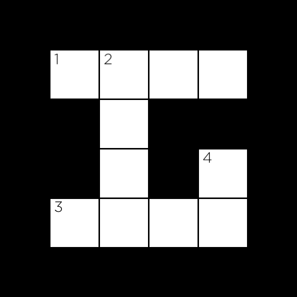

# [Crossword](https://cs50.harvard.edu/ai/2020/projects/3/crossword/#crossword)

Write an AI to generate crossword puzzles.

```
$ python generate.py data/structure1.txt data/words1.txt output.png
██████████████
███████M████R█
█INTELLIGENCE█
█N█████N████S█
█F██LOGIC███O█
█E█████M████L█
█R███SEARCH█V█
███████X████E█
██████████████
```


## [When to Do It](https://cs50.harvard.edu/ai/2020/projects/3/crossword/#when-to-do-it)

By Monday, January 1, 2024, 12:59 PM GMT+8.


## [How to Get Help](https://cs50.harvard.edu/ai/2020/projects/3/crossword/#how-to-get-help)

1. Ask questions via [Ed](https://cs50.edx.org/ed)!
2. Ask questions via any of CS50’s [communities](https://cs50.harvard.edu/ai/2020/communities/)!


## [Background](https://cs50.harvard.edu/ai/2020/projects/3/crossword/#background)

How might you go about generating a crossword puzzle? Given the structure of a crossword puzzle (i.e., which squares of the grid are meant to be filled in with a letter), and a list of words to use, the problem becomes one of choosing which words should go in each vertical or horizontal sequence of squares. We can model this sort of problem as a constraint satisfaction problem. Each sequence of squares is one variable, for which we need to decide on its value (which word in the domain of possible words will fill in that sequence). Consider the following crossword puzzle structure.



In this structure, we have four variables, representing the four words we need to fill into this crossword puzzle (each indicated by a number in the above image). Each variable is defined by four values: the row it begins on (its `i` value), the column it begins on (its `j` value), the direction of the word (either down or across), and the length of the word. Variable 1, for example, would be a variable represented by a row of `1` (assuming `0` indexed counting from the top), a column of `1` (also assuming `0` indexed counting from the left), a direction of `across`, and a length of `4`.

As with many constraint satisfaction problems, these variables have both unary and binary constraints. The unary constraint on a variable is given by its length. For Variable 1, for instance, the value `BYTE` would satisfy the unary constraint, but the value `BIT` would not (it has the wrong number of letters). Any values that don’t satisfy a variable’s unary constraints can therefore be removed from the variable’s domain immediately.

The binary constraints on a variable are given by its overlap with neighboring variables. Variable 1 has a single neighbor: Variable 2. Variable 2 has two neighbors: Variable 1 and Variable 3. For each pair of neighboring variables, those variables share an overlap: a single square that is common to them both. We can represent that overlap as the character index in each variable’s word that must be the same character. For example, the overlap between Variable 1 and Variable 2 might be represented as the pair `(1, 0)`, meaning that Variable 1’s character at index 1 necessarily must be the same as Variable 2’s character at index 0 (assuming 0-indexing, again). The overlap between Variable 2 and Variable 3 would therefore be represented as the pair `(3, 1)`: character 3 of Variable 2’s value must be the same as character 1 of Variable 3’s value.

For this problem, we’ll add the additional constraint that all words must be different: the same word should not be repeated multiple times in the puzzle.

The challenge ahead, then, is write a program to find a satisfying assignment: a different word (from a given vocabulary list) for each variable such that all of the unary and binary constraints are met.


## [Getting Started](https://cs50.harvard.edu/ai/2020/projects/3/crossword/#getting-started)

- Download the distribution code from https://cdn.cs50.net/ai/2020/x/projects/3/crossword.zip and unzip it.


## [Understanding](https://cs50.harvard.edu/ai/2020/projects/3/crossword/#understanding)

There are two Python files in this project: `crossword.py` and `generate.py`. The first has been entirely written for you, the second has some functions that are left for you to implement.

First, let’s take a look at `crossword.py`. This file defines two classes, `Variable` (to represent a variable in a crossword puzzle) and `Crossword` (to represent the puzzle itself).

Notice that to create a `Variable`, we must specify four values: its row `i`, its column `j`, its direction (either the constant `Variable.ACROSS` or the constant `Variable.DOWN`), and its length.

The `Crossword` class requires two values to create a new crossword puzzle: a `structure_file` that defines the structure of the puzzle (the `_` is used to represent blank cells, any other character represents cells that won’t be filled in) and a `words_file` that defines a list of words (one on each line) to use for the vocabulary of the puzzle. Three examples of each of these files can be found in the `data` directory of the project, and you’re welcome to create your own as well.

Note in particular, that for any crossword object `crossword`, we store the following values:

- `crossword.height` is an integer representing the height of the crossword puzzle.
- `crossword.width` is an integer representing the width of the crossword puzzle.
- `crossword.structure` is a 2D list representing the structure of the puzzle. For any valid row `i` and column `j`, `crossword.structure[i][j]` will be `True` if the cell is blank (a character must be filled there) and will be `False` otherwise (no character is to be filled in that cell).
- `crossword.words` is a set of all of the words to draw from when constructing the crossword puzzle.
- `crossword.variables` is a set of all of the variables in the puzzle (each is a `Variable` object).
- `crossword.overlaps` is a dictionary mapping a pair of variables to their overlap. For any two distinct variables `v1` and `v2`, `crossword.overlaps[v1, v2]` will be `None` if the two variables have no overlap, and will be a pair of integers `(i, j)` if the variables do overlap. The pair `(i, j)` should be interpreted to mean that the `i`th character of `v1`’s value must be the same as the `j`th character of `v2`’s value.

Crossword objects also support a method `neighbors` that returns all of the variables that overlap with a given variable. That is to say, `crossword.neighbors(v1)` will return a set of all of the variables that are neighbors to the variable `v1`.

Next, take a look at `generate.py`. Here, we define a class `CrosswordCreator` that we’ll use to solve the crossword puzzle. When a `CrosswordCreator` object is created, it gets a `crossword` property that should be a `Crossword` object (and therefore has all of the properties described above). Each `CrosswordCreator` object also gets a `domains` property: a dictionary that maps variables to a set of possible words the variable might take on as a value. Initially, this set of words is all of the words in our vocabulary, but we’ll soon write functions to restrict these domains.

We’ve also defined some functions for you to help with testing your code: `print` will print to the terminal a representation of your crossword puzzle for a given assignment (every assignment, in this function and elsewhere, is a dictionary mapping variables to their corresponding words). `save`, meanwhile, will generate an image file corresponding to a given assignment (you’ll need to `pip3 install Pillow` if you haven’t already to use this function). `letter_grid` is a helper function used by both `print` and `save` that generates a 2D list of all characters in their appropriate positions for a given assignment: you likely won’t need to call this function yourself, but you’re welcome to if you’d like to.

Finally, notice the `solve` function. This function does three things: first, it calls `enforce_node_consistency` to enforce node consistency on the crossword puzzle, ensuring that every value in a variable’s domain satisfy the unary constraints. Next, the function calls `ac3` to enforce arc consistency, ensuring that binary constraints are satisfied. Finally, the function calls `backtrack` on an initially empty assignment (the empty dictionary `dict()`) to try to calculate a solution to the problem.

The functions `enforce_node_consistency`, `ac3`, and `backtrack`, though, are not yet implemented (among other functions). That’s where you come in!


## [Specification](https://cs50.harvard.edu/ai/2020/projects/3/crossword/#specification)

An automated tool assists the staff in enforcing the constraints in the below specification. Your submission will fail if any of these are not handled properly, if you import modules other than those explicitly allowed, or if you modify functions other than as permitted.

Complete the implementation of `enforce_node_consistency`, `revise`, `ac3`, `assignment_complete`, `consistent`, `order_domain_values`, `selected_unassigned_variable`, and `backtrack` in `generate.py` so that your AI generates complete crossword puzzles if it is possible to do so.

The `enforce_node_consistency` function should update `self.domains` such that each variable is node consistent.

- Recall that node consistency is achieved when, for every variable, each value in its domain is consistent with the variable’s unary constraints. In the case of a crossword puzzle, this means making sure that every value in a variable’s domain has the same number of letters as the variable’s length.
- To remove a value `x` from the domain of a variable `v`, since `self.domains` is a dictionary mapping variables to sets of values, you can call `self.domains[v].remove(x)`.
- No return value is necessary for this function.

The `revise` function should make the variable `x` arc consistent with the variable `y`.

- `x` and `y` will both be `Variable` objects representing variables in the puzzle.
- Recall that `x` is arc consistent with `y` when every value in the domain of `x` has a possible value in the domain of `y` that does not cause a conflict. (A conflict in the context of the crossword puzzle is a square for which two variables disagree on what character value it should take on.)
- To make `x` arc consistent with `y`, you’ll want to remove any value from the domain of `x` that does not have a corresponding possible value in the domain of `y`.
- Recall that you can access `self.crossword.overlaps` to get the overlap, if any, between two variables.
- The domain of `y` should be left unmodified.
- The function should return `True` if a revision was made to the domain of `x`; it should return `False` if no revision was made.

The `ac3` function should, using the AC3 algorithm, enforce arc consistency on the problem. Recall that arc consistency is achieved when all the values in each variable’s domain satisfy that variable’s binary constraints.

- Recall that the AC3 algorithm maintains a queue of arcs to process. This function takes an optional argument called `arcs`, representing an initial list of arcs to process. If `arcs` is `None`, your function should start with an initial queue of all of the arcs in the problem. Otherwise, your algorithm should begin with an initial queue of only the arcs that are in the list `arcs` (where each arc is a tuple `(x, y)` of a variable `x` and a different variable `y`).
- Recall that to implement AC3, you’ll revise each arc in the queue one at a time. Any time you make a change to a domain, though, you may need to add additional arcs to your queue to ensure that other arcs stay consistent.
- You may find it helpful to call on the `revise` function in your implementation of `ac3`.
- If, in the process of enforcing arc consistency, you remove all of the remaining values from a domain, return `False` (this means it’s impossible to solve the problem, since there are no more possible values for the variable). Otherwise, return `True`.
- You do not need to worry about enforcing word uniqueness in this function (you’ll implement that check in the `consistent` function.)

The `assignment_complete` function should (as the name suggests) check to see if a given `assignment` is complete.

- An `assignment` is a dictionary where the keys are `Variable` objects and the values are strings representing the words those variables will take on.
- An assignment is complete if every crossword variable is assigned to a value (regardless of what that value is).
- The function should return `True` if the assignment is complete and return `False` otherwise.

The `consistent` function should check to see if a given `assignment` is consistent.

- An `assignment` is a dictionary where the keys are `Variable` objects and the values are strings representing the words those variables will take on. Note that the assignment may not be complete: not all variables will necessarily be present in the assignment.
- An assignment is consistent if it satisfies all of the constraints of the problem: that is to say, all values are distinct, every value is the correct length, and there are no conflicts between neighboring variables.
- The function should return `True` if the assignment is consistent and return `False` otherwise.

The `order_domain_values` function should return a list of all of the values in the domain of `var`, ordered according to the least-constraining values heuristic.

- `var` will be a `Variable` object, representing a variable in the puzzle.
- Recall that the least-constraining values heuristic is computed as the number of values ruled out for neighboring unassigned variables. That is to say, if assigning `var` to a particular value results in eliminating `n` possible choices for neighboring variables, you should order your results in ascending order of `n`.
- Note that any variable present in `assignment` already has a value, and therefore shouldn’t be counted when computing the number of values ruled out for neighboring unassigned variables.
- For domain values that eliminate the same number of possible choices for neighboring variables, any ordering is acceptable.
- Recall that you can access `self.crossword.overlaps` to get the overlap, if any, between two variables.
- It may be helpful to first implement this function by returning a list of values in any arbitrary order (which should still generate correct crossword puzzles). Once your algorithm is working, you can then go back and ensure that the values are returned in the correct order.
- You may find it helpful to [`sort`](https://docs.python.org/3/howto/sorting.html) a list according to a particular `key`: Python contains some helpful functions for achieving this.

The `select_unassigned_variable` function should return a single variable in the crossword puzzle that is not yet assigned by `assignment`, according to the minimum remaining value heuristic and then the degree heuristic.

- An `assignment` is a dictionary where the keys are `Variable` objects and the values are strings representing the words those variables will take on. You may assume that the assignment will not be complete: not all variables will be present in the assignment.
- Your function should return a `Variable` object. You should return the variable with the fewest number of remaining values in its domain. If there is a tie between variables, you should choose among whichever among those variables has the largest degree (has the most neighbors). If there is a tie in both cases, you may choose arbitrarily among tied variables.
- It may be helpful to first implement this function by returning any arbitrary unassigned variable (which should still generate correct crossword puzzles). Once your algorithm is working, you can then go back and ensure that you are returning a variable according to the heuristics.
- You may find it helpful to [`sort`](https://docs.python.org/3/howto/sorting.html) a list according to a particular `key`: Python contains some helpful functions for achieving this.

The `backtrack` function should accept a partial assignment `assignment` as input and, using backtracking search, return a complete satisfactory assignment of variables to values if it is possible to do so.

- An `assignment` is a dictionary where the keys are `Variable` objects and the values are strings representing the words those variables will take on. The input assignment may not be complete (not all variables will necessarily have values).
- If it is possible to generate a satisfactory crossword puzzle, your function should return the complete assignment: a dictionary where each variable is a key and the value is the word that the variable should take on. If no satisfying assignment is possible, the function should return `None`.
- If you would like, you may find that your algorithm is more efficient if you interleave search with inference (as by maintaining arc consistency every time you make a new assignment). You are not required to do this, but you are permitted to, so long as your function still produces correct results. (It is for this reason that the `ac3` function allows an `arcs` argument, in case you’d like to start with a different queue of arcs.)

You should not modify anything else in `generate.py` other than the functions the specification calls for you to implement, though you may write additional functions and/or import other Python standard library modules. You may also import `numpy` or `pandas`, if familiar with them, but you should not use any other third-party Python modules. You should not modify anything in `crossword.py`.


## [Hints](https://cs50.harvard.edu/ai/2020/projects/3/crossword/#hints)

- For `order_domain_values` and `select_unassigned_variable`, it may be helpful to implement them first without worrying about the heuristics, and then add heuristics later. Your algorithm will still work: it just may end up exploring more assignments than it needs to before finding a solution.
- To run your program, you can run a command like `python generate.py data/structure1.txt data/words1.txt`, specifying a structure file and a words file. If an assignment is possible, you should see the resulting assignment printed. You may also add an additional command-line argument for an image file, as by running `python generate.py data/structure1.txt data/words1.txt output.png`, to generate an image representation of the resulting crossword puzzle as well.
- The `Crossword` class has a `neighbors` function you can use to access all of the neighbors (i.e., overlapping variables) of a particular variable. Feel free to use that any time you need to determine the neighbors of a particular variable!


## [How to Submit](https://cs50.harvard.edu/ai/2020/projects/3/crossword/#how-to-submit)

You may not have your code in your `ai50/projects/2020/x/crossword` branch nested within any further subdirectories (such as a subdirectory called `crossword` or `project3`). That is to say, if the staff attempts to access `https://github.com/me50/USERNAME/blob/ai50/projects/2020/x/crossword/generate.py`, where `USERNAME` is your GitHub username, that is exactly where your file should live. If your file is not at that location when the staff attempts to grade, your submission will fail.

1. Visit [this link](https://submit.cs50.io/invites/8f7fa48876984cda98a73ba53bcf01fd), log in with your GitHub account, and click **Authorize cs50**. Then, check the box indicating that you’d like to grant course staff access to your submissions, and click **Join course**.

2. [Install Git](https://git-scm.com/downloads) and, optionally, [install `submit50`](https://cs50.readthedocs.io/submit50/).

3. If you’ve installed `submit50`, execute

    ```
    submit50 ai50/projects/2020/x/crossword
    ```

    Otherwise, using Git, push your work to `https://github.com/me50/USERNAME.git`, where `USERNAME` is your GitHub username, on a branch called `ai50/projects/2020/x/crossword`.

4. Submit [this form](https://forms.cs50.io/c5a913bf-c668-45a3-88cc-31f4f8bcbbfe).

You can then go to https://cs50.me/cs50ai to view your current progress!