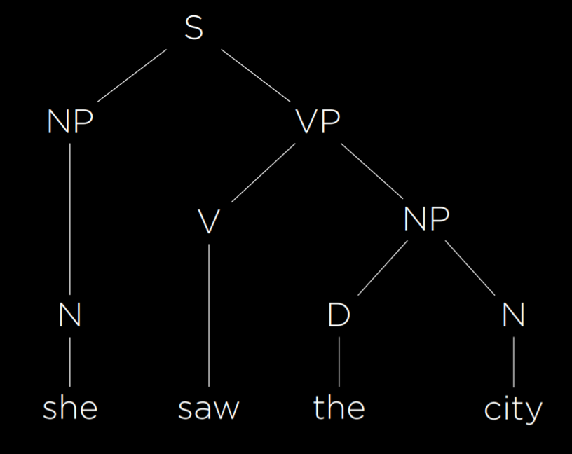
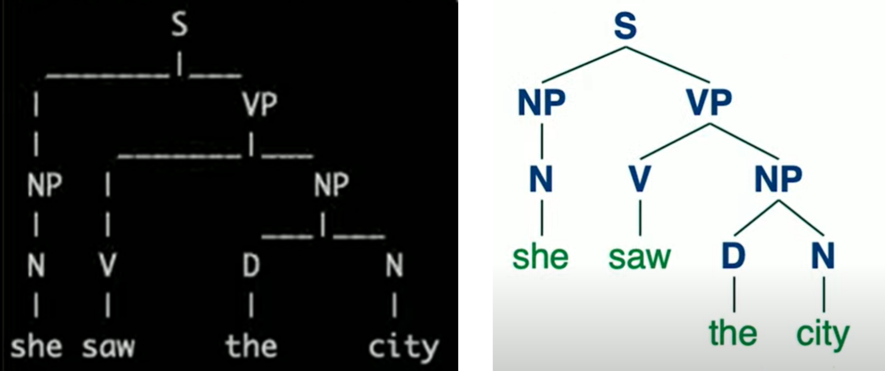
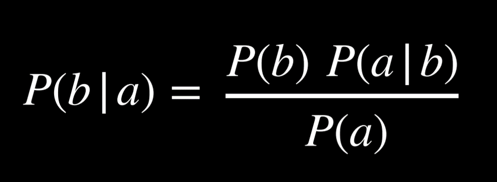
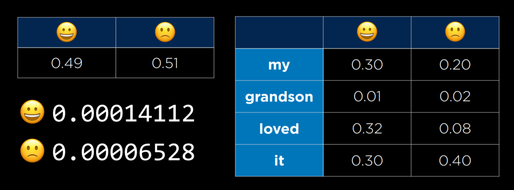
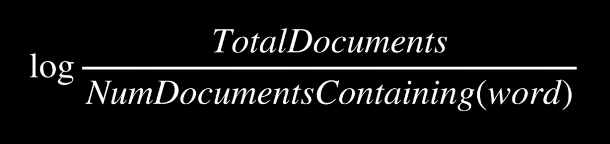
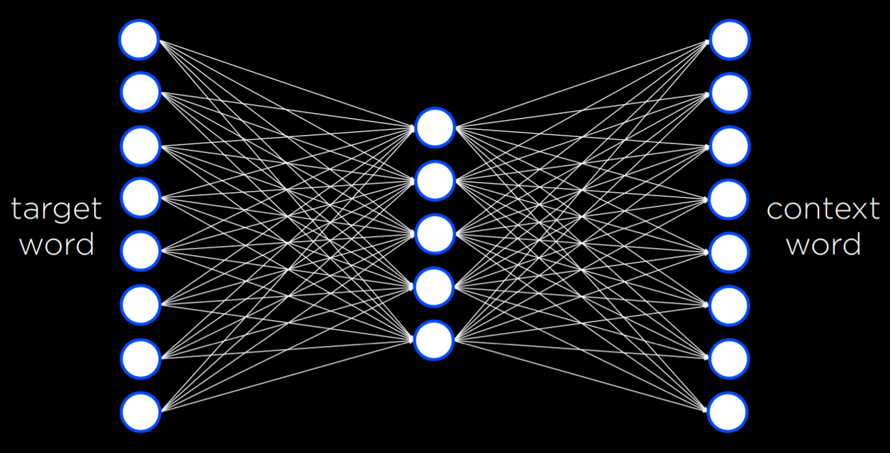

# [Lecture 6](https://cs50.harvard.edu/ai/2020/notes/6/#lecture-6)


## [Language](https://cs50.harvard.edu/ai/2020/notes/6/#language)

So far in the course, we needed to shape tasks and data such that an AI will be able to process them. Today, we will look at how an AI can be constructed to process human language.

**Natural Language Processing** spans all tasks where the AI gets human language as input. The following are a few examples of such tasks:

- automatic summarization, where the AI is given text as input and it produces a summary of the text as output.
- information extraction, where the AI is given a corpus of text and the AI extracts data as output.
- language identification, where the AI is given text and returns the language of the text as output.
- machine translation, where the AI is given a text in the origin language and it outputs the translation in the target language.
- named entity recognition, where the AI is given text and it extracts the names of the entities in the text (for example, names of companies).
- speech recognition, where the AI is given speech and it produces the same words in text.
- text classification, where the AI is given text and it needs to classify it as some type of text.
- word sense disambiguation, where the AI needs to choose the right meaning of a word that has multiple meanings (e.g. bank means both a financial institution and the ground on the sides of a river).


## [Syntax and Semantics](https://cs50.harvard.edu/ai/2020/notes/6/#syntax-and-semantics)

**Syntax** is sentence structure. As native speakers of some human language, we don’t struggle with producing grammatical sentences and flagging non-grammatical sentences as wrong. For example, the sentence “Just before nine o’clock Sherlock Holmes stepped briskly into the room” is grammatical, whereas the sentence “Just before Sherlock Holmes nine o’clock stepped briskly the room” is non-grammatical. Syntax can be grammatical and ambiguous at the same time, as in “I saw the man with the telescope.” Did I see (the man with the telescope) or did I see (the man), doing so by looking through the telescope? To be able to parse human speech and produce it, the AI needs to command syntax.

**Semantics** is the meaning of words or sentences. While the sentence “Just before nine o’clock Sherlock Holmes stepped briskly into the room” is syntactically different from “Sherlock Holmes stepped briskly into the room just before nine o’clock,” their content is effectively identical. Similarly, although the sentence “A few minutes before nine, Sherlock Holmes walked quickly into the room” uses different words from the previous sentences, it still carries a very similar meaning. Moreover, a sentence can be perfectly grammatical while being completely nonsensical, as in Chomsky’s example, “Colorless green ideas sleep furiously.” To be able to parse human speech and produce it, the AI needs to command semantics.


## [Context-Free Grammar](https://cs50.harvard.edu/ai/2020/notes/6/#context-free-grammar)

**Formal Grammar** is a system of rules for generating sentences in a language. In **Context-Free Grammar**, the text is abstracted from its meaning to represent the structure of the sentence using formal grammar. Let’s consider the following example sentence:

- She saw the city.

This is a simple grammatical sentence, and we would like to generate a syntax tree representing its structure.

We start by assigning each word its part of speech. *She* and *city* are nouns, which we will mark as N. *Saw* is a verb, which we will mark as V. *The* is a determiner, marking the following noun as definite or indefinite, and we will mark it as D. Now, the above sentence can be rewritten as

- N V D N

So far, we have abstracted each word from its semantic meaning to its part of speech. However, words in a sentence are connected to each other, and to understand the sentence we must understand how they connect. A noun phrase (NP) is a group of words that connect to a noun. For example, the word *she* is a noun phrase in this sentence. In addition, the words *the city* also form a noun phrase, consisting of a determiner and a noun. A verb phrase (VP) is a group of words that connect to a verb. The word *saw* is a verb phrase in itself. However, the words *saw the city* also make a verb phrase. In this case, it is a verb phrase consisting of a verb and a noun phrase, which in turn consists of a determiner and a noun. Finally, the whole sentence (S) can be represented as follows:



Using formal grammar, the AI is able to represent the structure of sentences. In the grammar we have described, there are enough rules to represent the simple sentence above. To represent more complex sentences, we will have to add more rules to our formal grammar.


## [nltk](https://cs50.harvard.edu/ai/2020/notes/6/#nltk)

As is often the case in Python, multiple libraries have been written to implement the idea above. nltk (Natural Language Toolkit) is one such library. To analyze the sentence from above, we will provide the algorithm with rules for the grammar:

```python
import nltk

grammar = nltk.CFG.fromstring("""
    S -> NP VP

    NP -> D N | N
    VP -> V | V NP

    D -> "the" | "a"
    N -> "she" | "city" | "car"
    V -> "saw" | "walked"
""")

parser = nltk.ChartParser(grammar)
```

Similar to what we did above, we define what possible components could be included in others. A sentence can include a noun phrase and a verb phrase, while the phrases themselves can consist of other phrases, nouns, verbs, etc., and, finally, each part of speech spans some words in the language.

```python
sentence = input("Sentence: ").split()
try:
    for tree in parser.parse(sentence):
        tree.pretty_print()
        tree.draw()
except ValueError:
    print("No parse tree possible.")
```

After giving the algorithm an input sentence split into a list of words, the function prints the resulting syntactic tree (pretty_print) and also generates a graphic representation (draw).




## [*n*](https://cs50.harvard.edu/ai/2020/notes/6/#n-grams)[-grams](https://cs50.harvard.edu/ai/2020/notes/6/#n-grams)

An *n*-gram is a sequence of *n* items from a sample of text. In a **character \*n\*-gram**, the items are characters, and in a **word \*n\*-gram** the items are words. A *unigram*, *bigram*, and *trigram* are sequences of one, two, and three items. In the following sentence, the first three *n*-grams are “how often have,” “often have I,” and “have I said.”

“How often have I said to you that when you have eliminated the impossible whatever remains, however improbable, must be the truth?”

*n*-grams are useful for text processing. While the AI hasn’t necessarily seen the whole sentence before, it sure has seen parts of it, like “have I said.” Since some words occur together more often then others, it is possible to also predict the next word with some probability. For example, your smartphone suggests words to you based on a probability distribution derived from the last few words you typed. Thus, a helpful step in natural language processing is breaking the sentence into n-grams.


## [Tokenization](https://cs50.harvard.edu/ai/2020/notes/6/#tokenization)

Tokenization is the task of splitting a sequence of characters into pieces (tokens). Tokens can be words as well as sentences, in which case the task is called **word tokenization** or **sentence tokenization**. We need tokenization to be able to look at *n*-grams, since those rely on sequences of tokens. We start by splitting the text into words based on the space character. While this is a good start, this method is imperfect because we end up with words with punctuation, such as “remains,”. So, for example, we can remove punctuation. However, then we face additional challenges, such as words with apostrophes (e.g. “o’clock”) and hyphens (e.g. “pearl-grey). Additionally, some punctuation is important for sentence structure, like periods. However, we need to be able to tell apart between a period at the end of the word “Mr.” and a period in the end of the sentence. Dealing with these questions is the process of tokenization. In the end, once we have our tokens, we can start looking at *n*-grams.


## [Markov Models](https://cs50.harvard.edu/ai/2020/notes/6/#markov-models)

As discussed in previous lectures, Markov models consist of nodes, the value of each of which has a probability distribution based on a finite number of previous nodes. Markov models can be used to generate text. To do so, we train the model on a text, and then establish probabilities for every *n*-th token in an *n*-gram based on the *n* words preceding it. For example, using trigrams, after the Markov model has two words, it can choose a third one from a probability distribution based on the first two. Then, it can choose a fourth word from a probability distribution based on the second and third words. To see an implementation of such a model using nltk, refer to generator.py in the source code, where our model learns to generate Shakespeare-sounding sentences. Eventually, using Markov models, we are able to generate text that is often grammatical and sounding superficially similar to human language output. However, these sentences lack actual meaning and purpose.


## [Bag-of-Words Model](https://cs50.harvard.edu/ai/2020/notes/6/#bag-of-words-model)

Bag-of-words is a model that represents text as an unordered collection of words. This model ignores syntax and considers only the meanings of the words in the sentence. This approach is helpful in some classification tasks, such as sentiment analysis (another classification task would be distinguishing regular email from spam email). Sentiment analysis can be used, for instance, in product reviews, categorizing reviews as positive or negative. Consider the following sentences:

1. “My grandson loved it! So much fun!”
2. “Product broke after a few days.”
3. “One of the best games I’ve played in a long time.”
4. “Kind of cheap and flimsy, not worth it.”

Based only on the words in each sentence and ignoring the grammar, we can see that sentences 1 and 3 are positive (“loved,” “fun,” “best”) and sentences 2 and 4 are negative (“broke,” “cheap,” “flimsy”).


## [Naive Bayes](https://cs50.harvard.edu/ai/2020/notes/6/#naive-bayes)

Naive Bayes is a technique that’s can be used in sentiment analysis with the bag-of-words model. In sentiment analysis, we are asking “What is the probability that the sentence is positive/negative given the words in the sentence.” Answering this question requires computing conditional probability, and it is helpful to recall Bayes’ rule from lecture 2:



Now, we would like to use this formula to find P(sentiment | text), or, for example, P(positive | “my grandson loved it”). We start by tokenizing the input, such that we end up with P(positive | “my”, “grandson”, “loved”, “it”). Applying Bayes’ ruled directly, we get the following expression: P(“my”, “grandson”, “loved”, “it” | positive)*P(positive)/P(“my”, “grandson”, “loved”, “it”). This complicated expression will give us the precise answer to P(positive | “my”, “grandson”, “loved”, “it”).

However, we can simplify the expression if we are willing to get an answer that’s not equal, but proportional to P(positive | “my”, “grandson”, “loved”, “it”). Later on, knowing that the probability distribution needs to sum up to 1, we can normalize the resulting value into an exact probability. This means that we can simplify the expression above to the numerator only: P(“my”, “grandson”, “loved”, “it” | positive)*P(positive). Again, we can simplify this expression based on the knowledge that a conditional probability of *a* given *b* is proportional to the joint probability of *a* and *b*. Thus, we get the following expression for our probability: P(positive, “my”, “grandson”, “loved”, “it”)*P(positive). Calculating this joint probability, however, is complicated, because the probability of each word is conditioned on the probabilities of the words preceding it. It requires us to compute P(positive)*P(“my” | positive)*P(“grandson” | positive, “my”)*P(loved | positive, “my”, “grandson”)*P(“it” | positive, “my”, “grandson”, “loved”).

Here is where we use Bayes’ rules naively: we assume that the probability of each word is independent from other words. This is not true, but despite this imprecision, Naive Bayes’ produces a good sentiment estimate. Using this assumption, we end up with the following probability: P(positive)*P(“my” | positive)*P(“grandson” | positive)*P(“loved” | positive)*P(“it” | positive), which is not that difficult to calculate. P(positive) = the number of all positive samples divided by the number of total samples. P(“loved” | positive) is equal to the number of positive samples with the word “loved” divided by the number of positive samples. Let’s consider the example below, with smiling and frowning emojies substituting the words “positive” and “negative”:



On the right we are seeing a table with the conditional probabilities of each word on the left occurring in a sentence given that the sentence is positive or negative. In the small table on the left we are seeing the probability of a positive or a negative sentence. On the bottom left we are seeing the resulting probabilities following the computation. At this point, they are in proportion to each other, but they don’t tell us much in terms of probabilities. To get the probabilities, we need to normalize the values, arriving at P(positive) = 0.6837 and P(negative) = 0.3163. The strength of naive Bayes is that it is sensitive to words that occur more often in one type of sentence than in the other. In our case, the word “loved” occurs much more often in positive sentences, which makes the whole sentence more likely to be positive than negative. To see an implementation of sentiment assessment using Naive Bayes with the nltk library, refer to sentiment.py.

One problem that we can run into is that some words may never appear in a certain type of sentence. Suppose none of the positive sentences in our sample had the word “grandson.” Then, P(“grandson” | positive) = 0, and when computing the probability of the sentence being positive we will get 0. However, this is not the case in reality (not all sentences mentioning grandsons are negative). One way to go about this problem is with **Additive Smoothing**, where we add a value α to each value in our distribution to smooth the data. This way, even if a certain value is 0, by adding α to it we won’t be multiplying the whole probability for a positive or negative sentence by 0. A specific type of additive smoothing, **Laplace Smoothing** adds 1 to each value in our distribution, pretending that all values have been observed at least once.


## [Information Retrieval](https://cs50.harvard.edu/ai/2020/notes/6/#information-retrieval)

Information retrieval is the task of finding relevant documents in response to a user query. To achieve this task, we use **topic modeling** to discover the topics for a set of documents. How can the AI go about extracting the topics of documents? One way to do so is by looking at **term frequency**, which is simply counting how many times a term appears in a document. The idea behind this is that key terms and important ideas are likely to repeat. To get term frequencies, we will work with the tf-idf library.


## [tf-idf](https://cs50.harvard.edu/ai/2020/notes/6/#tf-idf)

We can use the tf-idf library for information retrieval tasks. In lecture, we hoped to use term frequency to establish what the topics of each Sherlock Holmes story are in the corpus we had. However, when we ran the counting algorithm naively, the top-5 most common words were **function words**, words that are used for syntactic purposes in the sentence and not as independent units of meaning, such as “the,” “by,” “and,” “which,” “yet,” etc. By simply counting all the words by frequency of appearance we didn’t get the unique words that repeat in the corpus and define its topics, but the words that are the most common in the English language in general. The words that we are after are **content words**, words that carry meaning independently, such as “crime,” “brothers,” “demons,” “gentle,” “meek,” etc.

We can run the algorithm again, excluding words that we define as function words in the English language. Now the output becomes more indicative of the content of each document. However, in the case of Sherlock Holmes, the most common word in each document is, unsurprisingly, Holmes. Since we are searching the corpus of Sherlock Holmes story, having Holmes as one of the key words tells us nothing new about each story. This brings us to the idea of **Inverse Document Frequency**, which is a measure of how common or rare a word is across documents in a corpus. It is usually computed by the following equation:



Note that when the word appears in all documents, the value inside the logarithm is 1, and log(1) = 0. This is where the name of the library comes from: tf-idf stand for Term Frequency — Inverse Document Frequency. What this library is able to do is to multiply the term frequency of each word by the inverse document frequency, thus getting a value for each word. The more common the word is in one document and the fewer documents it appears in, the higher its value will be. Alternatively, the less common the word is in a document and the more common it is across documents, the lower its value. This lets us get as output a list of words per document that are likely to span the main topics that define the document.


## [Information Extraction](https://cs50.harvard.edu/ai/2020/notes/6/#information-extraction)

Information Extraction is the task of extracting knowledge from documents. So far, treating text with the bag-of-words approach was helpful when we wanted the AI to perform simple tasks, such as recognizing sentiment in a sentence as positive or negative, or retrieving the key words in a document. However, for a task like information extraction, where we need the AI to understand the connections between different words, the bag-of-words approach won’t get us very far.

A possible task of information extraction can take the form of giving a document to the AI as input and getting a list of companies and the years when they were founded as output. One way we can go about this is providing the AI with a template, such as “When {company} was founded in {year}.” This will not get us perfect results, because not all information about companies and their years of foundation are written in precisely this format. Still, if the dataset is large enough, we will definitely come across sentences of precisely this form, which will allow the AI to extract this knowledge. A more advanced approach would be to give the AI an abstracted example like “Facebook, 2004,” and let it develop its own model to extract the data. By going through enough data, the AI will be able to infer possible templates for extracting information similar to the example.

Using templates, even if self-generated by the AI, is helpful in tasks like Information Extraction. However, if we want the AI to be able to produce text like a human, the AI needs to be able to understand not just templates, but how all words in the language relate to each other in their meanings.


## [Word Net](https://cs50.harvard.edu/ai/2020/notes/6/#word-net)

Wordnet is a database similar to a dictionary, where words are given definitions as well as broader categories. For example, the word “house” will yield multiple definitions, one of which is “a dwelling that serves as living quarters for one or more families.” This definition is paired with the categories “building” and “dwelling.” Having access to these broader categories will allow us to make connections between words that are semantically similar.


## [Word Representation](https://cs50.harvard.edu/ai/2020/notes/6/#word-representation)

We want to represent word meanings in our AI. As we’ve seen before, it is convenient to provide input to the AI in the form of numbers. One way to go about this is by using **One-Hot Representation**, where each word is represented with a vector that consists of as many values as we have words. Except for a single value in the vector that is equal to 1, all other values are equal to 0. How we can differentiate words is by which of the values is 1, ending up with a unique vector per word. For example, the sentence “He wrote a book” can be represented as four vectors:

- [1, 0, 0, 0] (he)
- [0, 1, 0, 0] (wrote)
- [0, 0, 1, 0] (a)
- [0, 0, 0, 1] (book)

However, while this representation works in a world with four words, if we want to represent words from a dictionary, when we can have 50,000 words, we will end up with 50,000 vectors of length 50,000. This is incredibly inefficient. Another problem in this kind of representation is that we are unable to represent similarity between words like “wrote” and “authored.” Instead, we turn to the idea of **Distributed Representation**, where meaning is distributed across multiple values in a vector. With distributed representation, each vector has a limited number of values (much less than 50,000), taking the following form:

- [-0.34, -0.08, 0.02, -0.18, …] (he)
- [-0.27, 0.40, 0.00, -0.65, …] (wrote)
- [-0.12, -0.25, 0.29, -0.09, …] (a)
- [-0.23, -0.16, -0.05, -0.57, …] (book)

This allows us to generate unique values for each word while using smaller vectors. Additionally, now we are able to represent similarity between words by how different the values in their vectors are.

“You shall know a word by the company it keeps” is an idea by J. R. Firth, an English linguist. Following this idea, we can come to define words by their adjacent words. For example, there are limited words that we can use to complete the sentence “for ___ he ate.” These words are probably words like “breakfast,” “lunch,” and “dinner.” This brings us to the conclusion that by considering the environment in which a certain word tends to appear, we can infer the meaning of the word.


## [word2vec](https://cs50.harvard.edu/ai/2020/notes/6/#word2vec)

word2vec is an algorithm for generating distributed representations of words. It does so by **Skip-Gram Architecture**, which is a neural network architecture for predicting context given a target word. In this architecture, the neural network has an input unit for every target word. A smaller, single hidden layer (e.g. 50 or 100 units, though this number is flexible) will generate values that represent the distributed representations of words. Every unit in this hidden layer is connected to every unit in the input layer. The output layer will generate words that are likely to appear in a similar context as the target words. Similar to what we saw in last lecture, this network needs to be trained with a training dataset using the backpropagation algorithm.



This neural network turns out to be quite powerful. In the end, of the process, every word ends up being just a vector, or a sequence of numbers. For example,

book: [-0.226776 -0.155999 -0.048995 -0.569774 0.053220 0.124401 -0.091108 -0.606255 -0.114630 0.473384 0.061061 0.551323 -0.245151 -0.014248 -0.210003 0.316162 0.340426 0.232053 0.386477 -0.025104 -0.024492 0.342590 0.205586 -0.554390 -0.037832 -0.212766 -0.048781 -0.088652 0.042722 0.000270 0.356324 0.212374 -0.188433 0.196112 -0.223294 -0.014591 0.067874 -0.448922 -0.290960 -0.036474 -0.148416 0.448422 0.016454 0.071613 -0.078306 0.035400 0.330418 0.293890 0.202701 0.555509 0.447660 -0.361554 -0.266283 -0.134947 0.105315 0.131263 0.548085 -0.195238 0.062958 -0.011117 -0.226676 0.050336 -0.295650 -0.201271 0.014450 0.026845 0.403077 -0.221277 -0.236224 0.213415 -0.163396 -0.218948 -0.242459 -0.346984 0.282615 0.014165 -0.342011 0.370489 -0.372362 0.102479 0.547047 0.020831 -0.202521 -0.180814 0.035923 -0.296322 -0.062603 0.232734 0.191323 0.251916 0.150993 -0.024009 0.129037 -0.033097 0.029713 0.125488 -0.018356 -0.226277 0.437586 0.004913]

By themselves, these numbers don’t mean much. But by finding which other words in the corpus have the most similar vectors, we can run a function that will generate the words that are the most similar to the word *book*. In the case of this network it will be: book, books, essay, memoir, essays, novella, anthology, blurb, autobiography, audiobook. This is not bad for a computer! Through a bunch of numbers that don’t carry any specific meaning themselves, the AI is able to generate words that really are very similar to *book* not in letters or sounds, but in meaning! We can also compute the difference between words based on how different their vectors are. For example, the difference between *king* and *man* is similar to the difference between *queen* and *woman*. That is, if we add the difference between *king* and *man* to the vector for *woman*, the closest word to the resulting vector is *queen*! Similarly, if we add the difference between *ramen* and *japan* to *america*, we get *burritos*. By using neural networks and distributed representations for words, we get our AI to understand semantic similarities between words in the language, bringing us one step closer to AIs that can understand and produce human language.